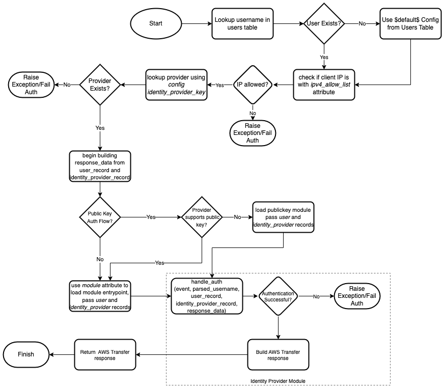
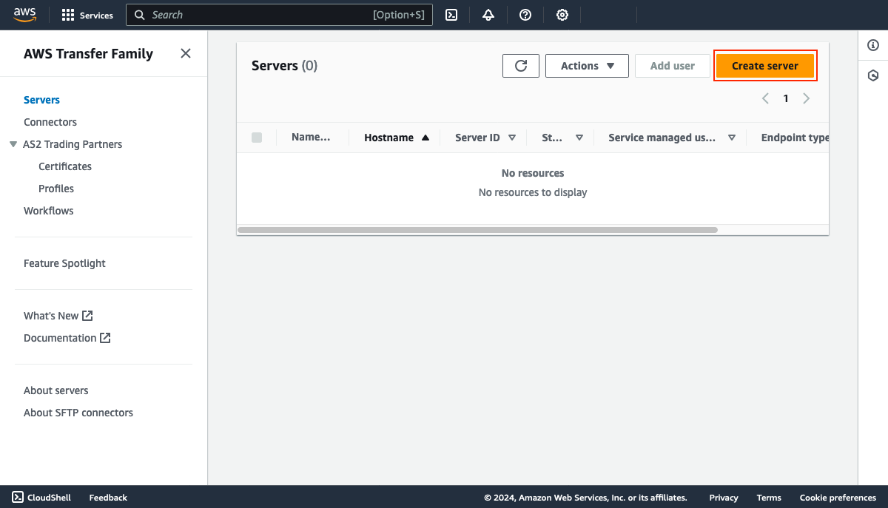
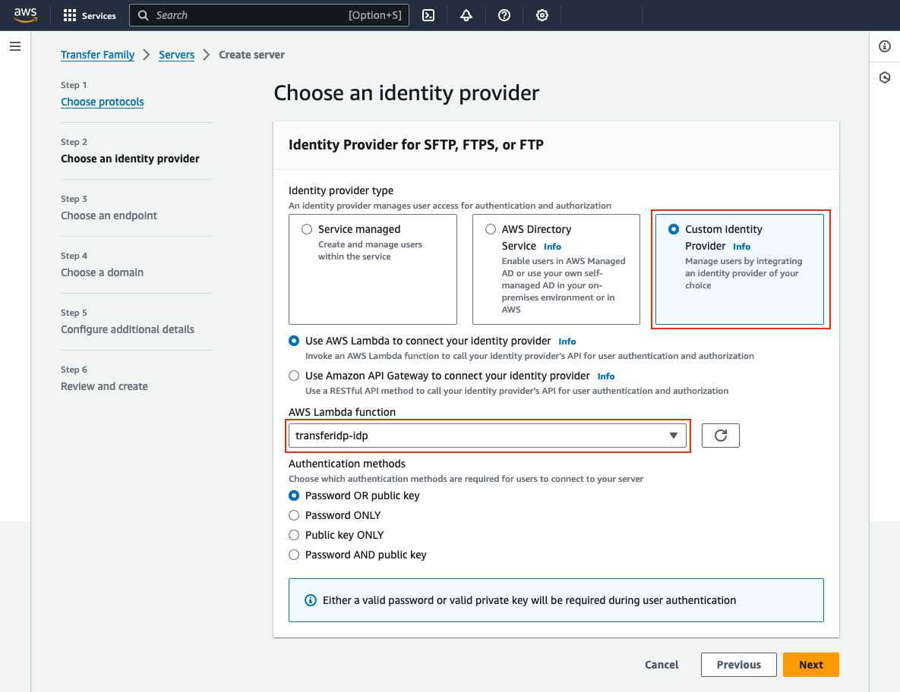
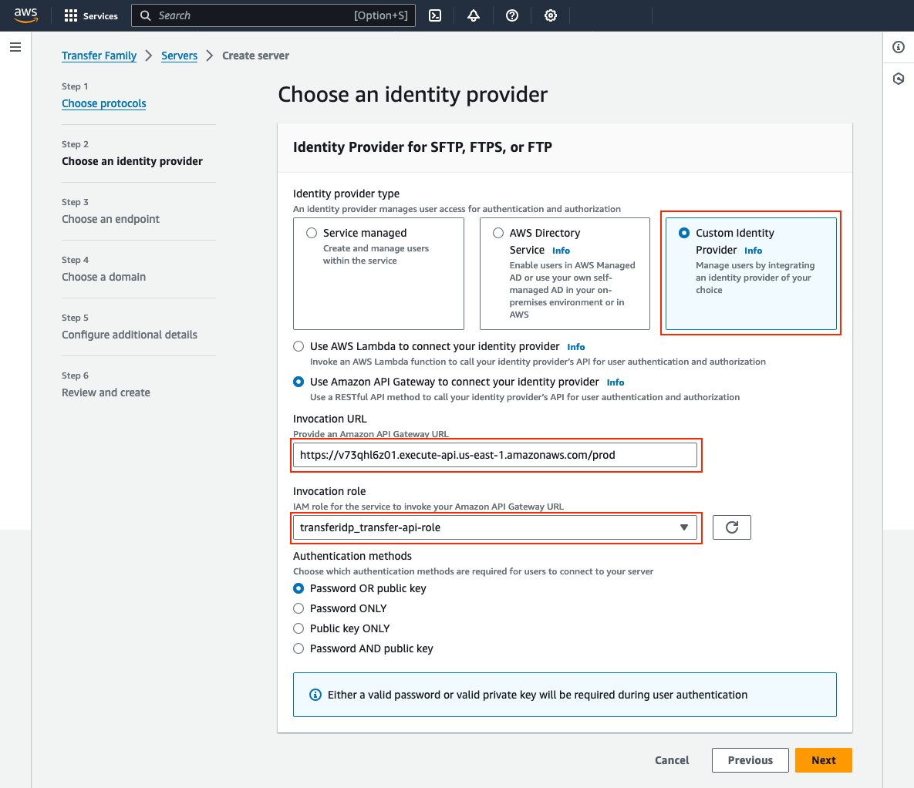
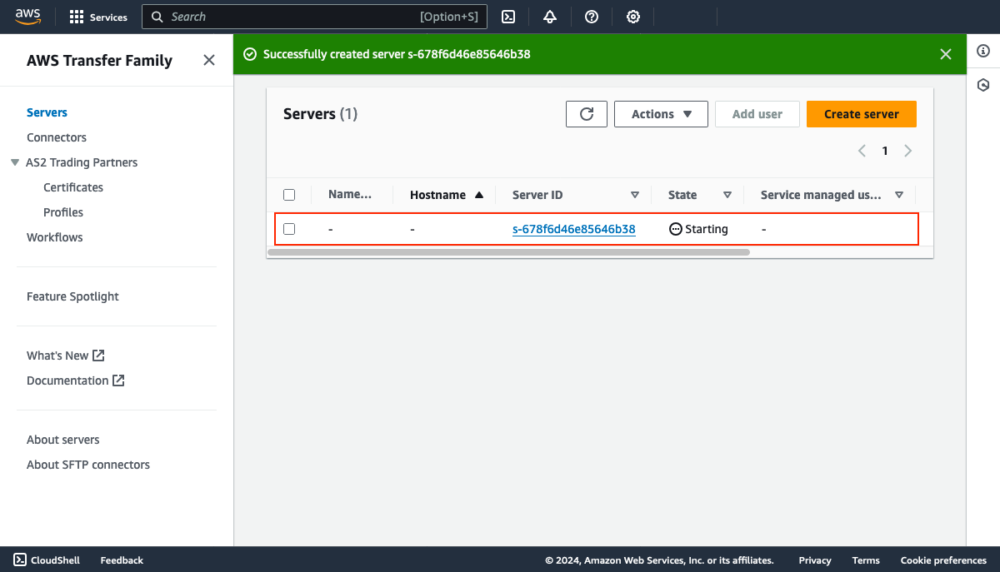
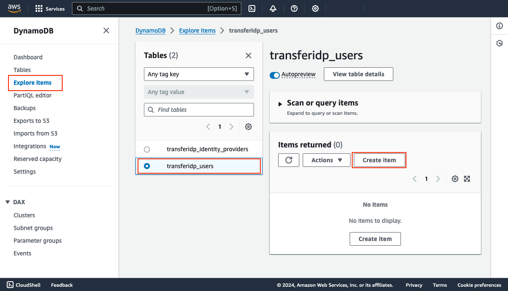
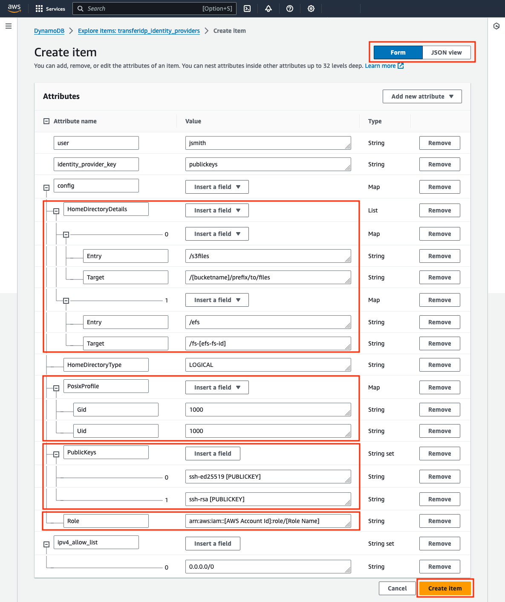

# AWS Transfer Family Custom IdP Solution
The AWS Transfer Family Custom IdP Solution is a modular [custom identity provider](https://docs.aws.amazon.com/transfer/latest/userguide/custom-lambda-idp.html) solution for AWS Transfer Family that solves for many common use authentication and authorization use cases that enterprises have when implementing the service.  This solution provides a reusable foundation for implementing custom identity providers with granular per-user session configuration and separates authentication and authorization logic, offering a flexible and easy-to-maintain foundation for various use cases. 

To get started, review the [Solution Overview](#solution-overview), then following the deployment instructions in the [Getting Started](#getting-started) section.

## Contents
- [AWS Transfer Family Custom IdP Solution](#aws-transfer-family-custom-idp-solution)
  - [Contents](#contents)
- [Solution Overview](#solution-overview)
- [Architecture](#architecture)
  - [Process flow details](#process-flow-details)
    - [Lambda function](#lambda-function)
    - [Authentication module](#authentication-module)
  - [DynamoDB tables](#dynamodb-tables)
- [Getting Started](#getting-started)
  - [Prerequisites](#prerequisites)
  - [Deploy the solution](#deploy-the-solution)
  - [Deploy an AWS Transfer server](#deploy-an-aws-transfer-server)
  - [Define identity providers](#define-identity-providers)
  - [Define users](#define-users)
  - [(Optional) Define a `$default$` user record](#optional-define-a-default-user-record)
  - [Test the provider](#test-the-provider)
  - [Next steps](#next-steps)
- [Getting help](#getting-help)
- [User record reference](#user-record-reference)
  - [DynamoDB Record Schema](#dynamodb-record-schema)
  - [Parameters](#parameters)
- [Identity provider modules](#identity-provider-modules)
  - [How identity provider modules work](#how-identity-provider-modules-work)
  - [Identity provider module reference](#identity-provider-module-reference)
    - [Argon2](#argon2)
      - [DynamoDB Record Schema](#dynamodb-record-schema-1)
      - [Parameters](#parameters-1)
      - [Example](#example)
    - [Cognito](#cognito)
      - [DynamoDB Record Schema](#dynamodb-record-schema-2)
      - [Parameters](#parameters-2)
      - [Example](#example-1)
    - [LDAP and Active Directory](#ldap-and-active-directory)
      - [DynamoDB Record Schema](#dynamodb-record-schema-3)
      - [Parameters](#parameters-3)
      - [Example](#example-2)
    - [Okta](#okta)
      - [DynamoDB Record Schema](#dynamodb-record-schema-4)
      - [Parameters](#parameters-4)
      - [Example](#example-3)
    - [Public Key](#public-key)
      - [DynamoDB Record Schema](#dynamodb-record-schema-5)
      - [Parameters](#parameters-5)
      - [Example](#example-4)
      - [Secrets Manager](#secrets-manager)
  - [AWS Transfer session settings inheritance](#aws-transfer-session-settings-inheritance)
    - [Example](#example-5)
  - [Modifying/updating solution parameters](#modifyingupdating-solution-parameters)
  - [Updating the solution](#updating-the-solution)
  - [Uninstall the solution](#uninstall-the-solution)
    - [Cleanup remaining artifacts](#cleanup-remaining-artifacts)
  - [Logging and troubleshooting](#logging-and-troubleshooting)
    - [Testing custom identity providers](#testing-custom-identity-providers)
    - [Accessing logs](#accessing-logs)
    - [Setting the log level](#setting-the-log-level)
  - [FAQ](#faq)
  - [Common issues](#common-issues)
  - [Tutorials](#tutorials)
    - [Setting up Okta](#setting-up-okta)
    - [Configuring Okta MFA](#configuring-okta-mfa)
    - [Configuring Okta to retrieve session settings from user profile attributes](#configuring-okta-to-retrieve-session-settings-from-user-profile-attributes)
  - [Security](#security)
  - [License](#license)

# Solution Overview

The AWS Transfer Family Custom IdP Solution provides these key features:

* An [AWS Serverless Application Model (AWS SAM)](https://aws.amazon.com/serverless/sam/) template that provisions the required resources. Optionally, deploy and configure [AWS API Gateway](https://aws.amazon.com/api-gateway/) to [incorporate AWS WAF](https://aws.amazon.com/blogs/storage/securing-aws-transfer-family-with-aws-web-application-firewall-and-amazon-api-gateway/).
* An [Amazon DynamoDB](https://aws.amazon.com/dynamodb/) schema to store configuration metadata about users and IdPs, including user session settings such as `HomeDirectoryDetails`, `Role`, and `Policy`.
* A modular approach that enables you to add new IdPs to the solution in the future as modules, such as the user’s own modules.
* Support for the following IdPs: LDAP (such as Microsoft AD), Okta, Public and Private Key, and [AWS Secrets Manager](https://aws.amazon.com/secrets-manager/).
* Support for multiple IdPs connected to a single Transfer Family Server and multiple Transfer Family servers using the same deployment of the solution.
* Built-in IP allow-list checking, such as IP allow lists that can optionally be configured on a per-user or per-IdP basis.
* Detailed logging with configurable log-level and tracing support to aide in troubleshooting

# Architecture
AWS Transfer Family Custom IdP Solution deploys an AWS Lambda function along with an Amazon DynamoDB database to store configuration metadata about users and IdPs. You can configure different modules (e.g. LDAP, Okta, public/private keys) to handle authentication against various IdPs. This modular approach enables the addition of new IdPs in the future and provides the ability to develop custom modules. The user records in the DynamoDB table map usernames to specific IdPs and store per-user settings like home directory details, roles, and POSIX profiles. When a client connects to the AWS Transfer Family server, the custom IdP Lambda function authenticates the user against the configured IdP module, retrieves the user-specific session settings from DynamoDB, and provisions those settings for the session.


## Process flow details

### Lambda function

The Custom IdP Lambda function's handler method contains logic for determining the user configuration and identity provider module to use to perform authentication. It also checks if the source IP is allowed to initiate an authentication request (based on ipv4_allow_list attribute in each user record) before invoking the target identity provider module.



1. The file transfer client connects to AWS Transfer service, passing credentials. The credentials are then passed to the custom IdP Lambda function
2. When the handler method in the Lambda function is called, it parses the username - and optionally the identity provider name - and performs a lookup on the `users` DynamoDB table. If a matching record exists, it retrieves the record and will use this for the authentication flow. If it does not exist, a [`$default$`](#optional-define-a-default-user-record) authentication record is used if it exists.
        
3. Using an `identity_provider_key` field, the Lambda performs a lookup on the `identity_providers` table to obtain IdP information. The `module` field in the response is used to call an IdP-specific module. The lambda then passes the parsed username, `identity_provider` and `user` records to the identity provider to continue the authentication flow. 
        
4. The identity provider module reads the provider-specific settings from the `identity_provider` record it receives. It then uses this to connect to the identity provider and passes the user credentials to authenticate. Since many identity providers are only available on private networks, the Lambda is VPC-attached and uses an ENI in a VPC for private network communication.
> [!NOTE]  
> Depending on the logic in the module and the configuration in the `identity_provider` record, the module could retrieve/return additional attributes for making authorization decisions. This is a module-specific implementation detail. For example, the LDAP module supports attribute retrieval.
        
5. After the identity provider module completes authentication, it can make additional authorization decisions based on what is in the user record and its own custom logic. It then finalizes all AWS Transfer session settings (i.e. `Role` and `HomeDirectoryDetails` and returns them to the handler function. The handler function does final validation and returns the response to AWS Transfer.


### Authentication module

The process flow diagram below is meant to serve as an example of what an individual identity provider module's logic would look like. All modules have the same entrypoint, `handle_auth`, and must return a response that is valid to AWS Transfer. Identity provider modules are built into the solution, and it is also possible to create additional modules or customize an existing one by forking this solution's repository.


## DynamoDB tables

The solution contains two DynamoDB tables:

* **`${AWS::StackName}_users`**: Contains records for each user, including the associated identity provider to use for authentication and AWS Transfer settings that should be used if authenticated successfully.
* **`${AWS::StackName}_identity_providers`**: Contains details about each identity provider and its associated configuration settings. 

These tables are created by default when deploying the SAM template. The SAM template also contains optional parameters that allow you to use existing DynamoDB tables when deploying the solution.

# Getting Started

The AWS Transfer Family Custom IdP Solution is deployed using a Serverless Application Model (SAM) template. The sections below describe how to deploy the solution into an AWS account, connect it to an AWS Transfer Family server, and configure a user and identity provider. 

## Prerequisites
Before deploying the solution, you will need the following: 
* A Virtual Private Cloud (VPC) with private subnets with either internet connectivity via NAT Gateway, or a DynamoDB Gateway Endpoint. 
* Appropriate IAM permissions to deploy the `custom-idp.yaml` CloudFormation template, including but not limited to creating CodePipeline and CodeBuild projects, IAM roles, and IAM policies.

> [!IMPORTANT]  
> The solution should be deployed in the same AWS account and region as the target AWS Transfer servers. 

## Deploy the solution
1. Log into the AWS account you wish to deploy the solution in, switch to the region you will run AWS Transfer in and start a CloudShell session.

    

2. Clone the solution into your environment:
    ```bash
    cd ~
    git clone https://github.com/aws-samples/toolkit-for-aws-transfer-family.git
    ```
    
3. Run the following command to start the build script, which downloads all package dependencies and generates archives for the Lambda layer and function used in the solution.
    ```bash
    cd ~/toolkit-for-aws-transfer-family/solutions/custom-idp
    ./build.sh
    ```
    Monitor the execution and verify the script completes successfully.

4. Begin the SAM deployment by using the following command

    ```bash
    sam deploy --guided --capabilities "CAPABILITY_NAMED_IAM"
    ```
    At the prompts, provide the following information:
    | Parameter | Description | Value |
    | --- | --- | --- |
    | **Stack name** | **REQUIRED**. The name of the CloudFormation stack that will be created. The stack name is also prefixed to several resources that are created to allow the solution to be deployed multiple times in the same AWS account and region. | *your stack name, i.e. transferidp* |
    | **UseVPC** | **REQUIRED**. When set to *`true`* the Lambda function will be attached to a VPC. If set to `false` the Lambda will be provisioned without a VPC and have outbound internet access. Default is `true`, as many IdPs require private connectivity via a VPC and/or communicating with IdPs via VPC is preferred. **When set to `true`, either `CreateVPC` must be set to `true` or `VPCId`, `Subnets`, and `SecurityGroups` must be specified**| `true` or `false`|    
    | **CreateVPC** | **REQUIRED**. Set to *`true`* if you you would like the solution to create a VPC for you, otherwise *`false`* | `true` or `false`|
    | **VPCCIDR** | **CONDITIONALLY REQUIRED**. Must be set if `CreateVPC` is `true`. The CIDR to use for when creating a new VPC. The CIDR should be at least a /24 and will be divided evenly across 4 subnets. Required if CreateVPC is set.  | `true` or `false`|   
    | **VPCId** | **CONDITIONALLY REQUIRED**. Must be set if `CreateVPC` is `false`. The ID of the VPC to deploy the custom IDP solution into. The VPC specified should have network connectivity to any IdPs that will used for authentication.  | *A VPC ID, i.e. `vpc-abc123def456`* |    
    | **Subnets** | **CONDITIONALLY REQUIRED**. Must be set if `CreateVPC` is `false`. A list of subnet IDs to attach the Lambda function to. The Lambda is attached to subnets in order to allow private communication to IdPs such as LDAP servers or Active Directory domain controllers. At least one subnet must be specified, and all subnets must be in the same VPC specified above. **IMPORTANT**: The subnets must be able to reach DynamoDB service endpoints. If using public IdP such as Okta, the subnet must also have a route to a NAT Gateway that can forward requests to the internet. *Using a public subnet will not work because Lambda network interfaces are not assigned public IP addresses*.  | *comma-separated list of subnet IDs, i.e. `subnet-123abc,subnet-456def`* |
    | **SecurityGroups** | **CONDITIONALLY REQUIRED**. Must be set if `CreateVPC` is false. A list of security group IDs to assign to the Lambda function. This is used to control inbound and outbound access to/from the ENI the Lambda function uses for network connectivity. At least one security group must be specified and the security group must belong to the VPC specified above. | *comma-separated list of Security Group IDs, i.e. `sg-abc123`* |
    | **UserNameDelimiter**  | The delimiter to use when specifying both the username and IdP name during login. Currently, only [username]**@**[IdP-name] is supported due to validation checks that AWS Transfer Family performs on the username. This parameter may eventually be eliminated from the template.  | **@** |    
    | **SecretsManagerPermissions** | Set to *`true`* if you will use the Secrets Manager authentication module, otherwise *`false`* | `true` or `false`|
    | **ProvisionApi** | When set to *`true`* an API Gateway REST API will be provisioned and integrated with the custom IdP Lambda. Provisioning and using an API Gateway REST API with AWS Transfer is useful if you intend to [use AWS Web Application Firewall (WAF) WebACLs to restrict requests to authenticate to specific IP addresses](https://aws.amazon.com/blogs/storage/securing-aws-transfer-family-with-aws-web-application-firewall-and-amazon-api-gateway/) or apply rate limiting. | `true` or `false` |    
    | **LogLevel** | Sets the verbosity of logging for the Lambda IdP function. This should be set to `INFO` by default and `DEBUG` when troubleshooting. <br /><br />**IMPORTANT** When set to `DEBUG`, sensitive information may be included in log entries. | `INFO` or `DEBUG` <br /> <br /> *`INFO` recommended as default* |
    | **EnableTracing** | Set to *`true`* if you would like to enable AWS X-Ray tracing on the solution. <br /><br /> Note: X-Ray has additional costs. | `true` or `false` |
    | **UsersTableName** | *Optional*. The name of an *existing* DynamoDB table that contains the details of each AWS Transfer user (i.e. IdP to use, IAM role, logic directory list) are stored. Useful if you have already created a DynamoDB table and records for users **Leave this value empty if you want a table to be created for you**. | *blank* if a new table should be created, otherwise the name of an existing *users* table in DynamoDB |
    | **IdentityProvidersTableName** | *Optional*. The name of an *existing* DynamoDB table that contains the details of each AWS Transfer custom IdPs (i.e. IdP name, server URL, parameters) are stored. Useful if you have already created a DynamoDB table and records for IdPs **Leave this value empty if you want a table to be created for you**. | *blank* if a new table should be created, otherwise the name of an existing *IdPs* table in DynamoDB |  
    | **Confirm changes before deploy** | Prompt to confirm changes after a change set is created. | `y` (default) | 
    | **Allow SAM CLI IAM role creation** | Allow SAM to create a CLI IAM role used for deployments | `y` (default) |
    | **Disable rollback** | Disable rollback if stack creation and resource provisioning fails. This can be useful for troubleshooting a failed deployment but is generally not required. | `n` (default) |
    | **Save arguments to configuration file** | Save the parameters specified above to a configuration file for reuse. | `y` (default) | 
    | **SAM configuration file** | The name of the file to save arguments to | `samconfig.toml` (default) |
    | **SAM configuration environment** | The name of the configuration environment to use | `default` (default) |    

## Deploy an AWS Transfer server

> [!NOTE]  
> If you have an existing AWS Transfer server configured to use a custom identity provider, it can be modified to use the Lambda function or API Gateway REST API instead of creating a new server. To do this, go to the AWS Transfer console, select the server, and click **Edit** next to the *Identity provider** section. If the server was not configured with a custom identity provider, or if you wish to switch between Lambda and API Gateway based providers, you will need to re-provision your AWS Transfer server.

1. Go to the AWS Transfer console in the region where the solution is deployed and click **Create server**.
   
  

2. At the **Choose protocols** screen, select the protocols to enable and click **Next**

3. At the **Choose an identity provider** screen, select **Custom Identity Provider**, then select one of the identity provider options below.

    **Option 1: Use AWS Lambda to connect your identity provider**
    
    Choose the AWS Lambda function from the list that matches the output from **`IdpHandlerFunction`** (i.e. `[StackName]_awstransfer_idp`)
    
    

    **Option 2: Use API Gateway to connect your identity provider**
    
    * Specify the API Gateway Url from the `ApiUrl` output (i.e. `https://[API].execute-api.[REGION].amazonaws.com/prod`)
    * Choose the IAM role from the list that matches the output from the **`ApiRole`** (i.e. `[StackName]_TransferApiRole`)

            

4. At the **Choose an endpoint** screen, configure the AWS transfer endpoint type and hostname, then click **Next**.
   
5. At the **Choose a domain** screen, select the AWS Storage Service to use (S3 or EFS) and click **Next**.

6. At the **Configure additional details** screen, configure any additional settings for the AWS Transfer server and click **Next**.

7. On the final screen, review and verify all settings for the new server and click **Create**.

8. At the AWS Transfer console, a new server will appear in the list and show status **Starting**. Wait for the process to complete and then proceed to configure Identity Providers.
   
    

## Define identity providers
To get started, you must define one or more identity providers in the DynamoDB table `$[StackName]_identity_providers`. Each identity provider record stores the configuration and identity provider module to use for authenticating users mapped to that provider. For complete details on identity provider modules, settings, and examples see the [Identity Provider Modules](#identity-provider-modules). To get started, this section will define an identity provider that uses the `public_key` module. 

> [!NOTE]  
> The `public_key` module is supported with AWS Transfer Servers that are configured with SFTP protocol only. If your server is using a different protocol, you should configure a different provider.

1. In the AWS Console, navigate to the [DynamoDB Item Explorer](https://console.aws.amazon.com/dynamodbv2/home#item-explorer). Select the `[StackName]_identity_providers` table, then click **Create Item**.

  

2. In the **Create Item** screen, click **JSON View**, then paste the following into the record:
  ```json
  {
    "provider": {
      "S": "publickeys"
    },
    "public_key_support": {
      "BOOL": true
    },        
    "config": {
      "M": {
      }
    },
    "module": {
      "S": "public_key"
    }
  }
  ```

1. Click the **Form** button to switch back to Form view. The attributes of the record will be displayed as shown in the screenshot below. 

   

     * The `provider` attribute contains the name defined of the identity provider. In this case, it is `publickeys` but it could be more meaningful such as `devteam-publickeys` or `example.com` if it were an external identity provider. 
     * The `module` attribute contains the name of the identity provider module to use, in this case `public_key`. 
     * The `config` is an attribute map that is used for storing identity provider configuration details. This `public_key` module is very simple and therefore has no configuration settings. Other modules such as LDAP and Okta store settings in this attribute map.

2. After reviewing, click **Create Item**. The first identity provider has now been defined. Next, we'll begin defining users.

## Define users

Once identity providers are defined, user records must be created. Each user record may contain the settings that will be used for an AWS Transfer session and can also contain public keys when using the `public_key` module or for AWS Transfer servers configured with **Password AND Key support**. Each record also maps the username to a given identity provider. In this section, we will create a user record and map it to the `publickeys` identity provider created in the previous section.

> [!IMPORTANT]  
> All usernames specified in the `[StackName]_users` must be entered as lowercase.

1. As a prerequisite, a public/private key pair must be generated for use with the `public_key` module. If you do not already have a key pair, you can follow the [Generate SSH Keys procedure](https://docs.aws.amazon.com/transfer/latest/userguide/key-management.html#sshkeygen) from the AWS Transfer documentation to generate them. You do NOT need to create a service managed user and enter the public key - please skip those steps.

2. Navigate to the [DynamoDB console](https://console.aws.amazon.com/dynamodb), select **Tables > Explore** items from the sidebar. Select the `[StackName]_users` table, then click **Create Item**.

  

3. In the **Create Item** screen, click **JSON View**, then paste the following into the record:
  ```json
  {
    "user": {
      "S": "jsmith"
    },
    "identity_provider_key": {
      "S": "publickeys"
    },  
    "config": {
      "M": {
        "HomeDirectoryDetails": {
          "L": [
            {
              "M": {
                "Entry": {
                  "S": "/s3files"
                },
                "Target": {
                  "S": "/[bucketname]/prefix/to/files"
                }
              }
            },
            {
              "M": {
                "Entry": {
                  "S": "/efs"
                },
                "Target": {
                  "S": "/fs-[efs-fs-id]"
                }
              }
            }
          ]
        },
        "HomeDirectoryType": {
          "S": "LOGICAL"
        },
        "PosixProfile": {
          "M": {
            "Gid": {
              "S": "1000"
            },
            "Uid": {
              "S": "1000"
            }
          }
        },
        "PublicKeys": {
          "SS": [
            "ssh-ed25519 [PUBLICKEY]",
            "ssh-rsa [PUBLICKEY]"
          ]
        },
        "Role": {
          "S": "arn:aws:iam::[AWS Account Id]:role/[Role Name]"
        }
      }
    },
    "ipv4_allow_list": {
      "SS": [
        "0.0.0.0/0"
      ]
    }
  }
  ```


1. Click the **Form** button to switch back to Form view, then expand the nested attributes. The attributes of the record will be displayed as shown in the screenshot below. Below are the details of the various fields:

     * The `user` key contains the username that will be passed to AWS Transfer during authentication. This will be used to lookup the user record. **For user lookups to succeed, this value must ALWAYS be lowercase.**
     * The `identity_provider_key` attribute contains the identity provider name from the `[StackName]_identity_providers` table. In this case, it is the `publickeys` provider created in the previous section. Note that this is the name of the identity provider, *not* the name of the identity provider module. 
     * The `ipv4_allow_list` attribute is a list of remote IP CIDRs that are allowed to authenticate as the user. This is an optional attribute and by default all remote IPs are allowed to authenticate as the user. 
     * The `config` attribute is a mapping of the user's session settings. Its values follow the same format as those found in the [Lambda Values Section](https://docs.aws.amazon.com/transfer/latest/userguide/custom-identity-provider-users.html#event-message-structure) of the custom identity provider documentation). This includes the `HomeDirectoryType`, `HomeDirectoryDetails` (for logical directory mappings),`PosixProfile`, and any `PublicKeys` associated with the user. Note that `PublicKeys` is an optional field, depending on the identity provider and AWS Transfer authentication method.
       * Note that `HomeDirectoryDetails` can have both S3 and EFS targets, in the scenario you wish to use the solution with both an S3 and EFS AWS Transfer server.

    

2. Modify the user configuration details to reflect your environment. Specifically, you should set:
  * `HomeDirectoryDetails`: Modify this list, setting the `Target` values to S3 buckets or EFS filesystems.
  * `PosixProfile`: If connecting to an AWS Transfer server attached to EFS, change the `Uid` and `Gid` to reflect those belonging to the user. Note that this is not required for Transfer servers attached to S3.
  * `PublicKeys`: Since this user will be authenticated with the `public_key` module, provide one or more valid public keys that will be used to authenticate the user (e.g. the contents of the `.pub` key generate in step 1 of this section). Each public key should be its own entry in the `PublicKeys`.
  * `Role`: Specify the AWS Transfer IAM Role that will be used to access data in S3 and EFS. Remember: This role must have a trust policy that gives the AWS Transfer service permission to assume it and must have the correct policies attached for accessing the data in S3 or EFS. For more information, refer to the [AWS Transfer documentation](https://docs.aws.amazon.com/transfer/latest/userguide/requirements-roles.html).


6. After reviewing, click **Create Item**. The first user, `jsmith`, has been created and mapped to the `publickeys`. Next we can (optionally) create a *default* user and finally test authentication.

## (Optional) Define a `$default$` user record
While this solution is designed to provide very granular and flexible authentication and authorization to AWS Transfer users to support a variety of use cases, there are use cases where all users will access the same identity provider and either apply the same AWS Transfer session configuration such as `Role`, `PosixProfile`, and `Policy`, or retrieve session configuration parameters dynamically from the source identity provider itself. The `$default$` user record is designed to support these scenarios. The `$default$` user record is used when the Lambda function is unable to find a user record that matches the username received in the request. 

Here are some important considerations for this record:
* If no `$default$` record is specified, authentication will simply fail (which may be intended).  
* Unless the identity provider overrides them, all users that authenticate with the `$default$` user will receive the session settings (i.e. `Role`, `PosixProfile`, and `Policy`) defined in the record. If more granularity is desired, you should define individual user records for each record.
* Be careful when specifying a `$default$` record when there are other user records specified. Keep in mind that any username that doesn't match will attempt to use `$default` which could produce unexpected session access.

Below is an example of a `$default$` user record, for mapped to an an Active Directory or LDAP identity provider. 

```json
{
  "user": {
    "S": "$default$"
  },
  "identity_provider_key": {
    "S": "example.com"
  },
  "config": {
    "M": {
      "HomeDirectoryDetails": {
        "L": [
          {
            "M": {
              "Entry": {
                "S": "/pics"
              },
              "Target": {
                "S": "/[bucket name]/pictures"
              }
            }
          },
          {
            "M": {
              "Entry": {
                "S": "/files"
              },
              "Target": {
                "S": "/[bucket name]/files"
              }
            }
          }
        ]
      },
      "HomeDirectoryType": {
        "S": "LOGICAL"
      },
      "Role": {
        "S": "arn:aws:iam::[aws account id]:role/[role name]"
      }
    }
  },
  "ipv4_allow_list": {
    "SS": [
      "0.0.0.0/0"
    ]
  }
}
```
To further illustrate a scenario where `$default$` is used, suppose `PosixProfile` and a scoped `Policy` are retrieved from Active Directory or LDAP server. This is what the identity provider record might look like.

```json
{
  "provider": {
    "S": "example.com"
  },
  "config": {
    "M": {
      "attributes": {
        "M": {
          "Gid": {
            "S": "gidNumber"
          },
          "Policy": {
            "S": "comment"
          },
          "Uid": {
            "S": "uidNumber"
          }
        }
      },
      "port": {
        "N": "636"
      },
      "search_base": {
        "S": "DC=EXAMPLE,DC=COM"
      },
      "server": {
        "S": "dc1.example.com"
      },
      "ssl": {
        "BOOL": true
      },
      "ssl_verify": {
        "BOOL": false
      }
    }
  },
  "module": {
    "S": "ldap"
  }
}
```
The record above dynamically maps Active Directory/LDAP attributes `uidNumber`, `gidNumber`, and `comments` to `Uid`, `Gid`, and scopedown `Policy` in the AWS Transfer session configuration.


## Test the provider
To test the identity provider `publickeys` and user `jsmith` created in the previous sections, use an SFTP client to connect to the AWS Transfer server. For example, on a Linux or Mac client with `sftp` client installed open a terminal window and enter the command to connect:
```bash
  sftp -i path/to/privatekey jsmith@[transfer-server-endpoint-address]
```

Below is an example of a successful connection and file/directory listing:


To view the provider logs, open Cloudwatch Logs and select the log group `/aws/lambda/[StackName]_awstransfer_idp`. The log streams will show the login event and details about the user and identity provider evaluation. If there was a failure, you will also see error messages and exceptions in this log. Below is a screenshot showing the logging in near realtime using [Cloudwatch Live Tail](https://docs.aws.amazon.com/AmazonCloudWatch/latest/logs/CloudWatchLogs_LiveTail.html). 


> [!NOTE]  
> If the Lambda logs don't show failures but SSH key authentication still fails and/or prompts for a password, it's possible that AWS Transfer did not successfully verify the supplied private key against the public key. It's also possible that required session properties were missing or misconfigured in the user record. Check the [AWS Transfer server log group](https://docs.aws.amazon.com/transfer/latest/userguide/structured-logging.html) for additional details.

## Next steps
With the solution setup completed and tested, you can begin adding more identity provider and user records and explore advanced functionality in each module to support your use case. The [identity provider modules](#identity-provider-modules) section provides detailed information about each identity provider, its configuration settings, and example configurations. 


# Getting help

The best way to interact with our team is through GitHub. You can open an [issue](https://github.com/aws/tookit-for-aws-transfer-family/issues/new/choose) and choose from one of our templates for bug reports, feature request, etc.

You may also find help on [AWS re:Post](https://repost.aws). When asking a question, tag it with `AWS Transfer Family`.
 

# User record reference
Each user record in DynamoDB must follow the schema below to be valid. Some fields are optional but may still be required in specific scenarios. Note that  module could store additional per-user information in the user record. For example, the `argon` module stores the user's password hash in the `argon2_hash` field within the `config` map. Any custom fields such as this are documented in the identity provider module reference section.

## DynamoDB Record Schema
```json
  {
    "user": {
      "S": "[username]"
    },
    "identity_provider_key": {
      "S": "[module]"
    },  
    "config": {
      "M": {
        "HomeDirectoryDetails": {
          "L": [
            {
              "M": {
                "Entry": {
                  "S": "[logical directory name]"
                },
                "Target": {
                  "S": "[S3 or EFS Path]"
                }
              }
            }
          ]
        },
        "HomeDirectory": {
          "S": "[S3 or EFS Path]"
        },        
        "HomeDirectoryType": {
          "S": "[LOGICAL or PATH]"
        },
        "PosixProfile": {
          "M": {
            "Gid": {
              "S": "[UID]"
            },
            "Uid": {
              "S": "[GID]"
            }
          }
        },
        "PublicKeys": {
          "SS": [
            "ssh-ed25519 [PUBLICKEY]",
            "ssh-rsa [PUBLICKEY]"
          ]
        },
        "Role": {
          "S": "arn:aws:iam::[AWS Account Id]:role/[Role Name]"
        },
        "Policy": {
          "S": "[Session Policy Statement]"
        },        
      }
    },
    "ipv4_allow_list": {
      "SS": [
        "[CIDR]",
        "[CIDR]"
      ]
    }
  }
```
## Parameters
**user**

The username of the user that will be authenticating to the identity provider.

> [!IMPORTANT]  
> The username **must be all lowercase**. 
> 
> To perform the lookup in the users DynamoDB table without forcing a full scan, the solution converts the username to lowercase and retrieves the record(s) matching that user. Therefore, all usernames must be entered as lowercase.
> 

***Type:*** String

***Constraints:*** None

***Required:*** Yes

**identity_provider_key**

A name used for referencing the identity provider in the `identity_providers` table to perform authentication. This value is also used when users specify an identity provider during authentication (e.g. `username@identity_provider_key`).

***Type:*** String

***Constraints:*** None

***Required:*** Yes

**config/HomeDirectoryDetails**

The list of `HomeDirectoryDetails` entries. These Logical directory mappings that specify which Amazon S3 or Amazon EFS paths and keys should be visible to your user and how you want to make them visible. You must specify the Entry and Target pair, where Entry is the directory displayed to the client and Target is the actual Amazon S3 or Amazon EFS path.

The format is:

```json
        "HomeDirectoryDetails": {
          "L": [
            {
              "M": {
                "Entry": {
                  "S": "[logical directory name]"
                },
                "Target": {
                  "S": "[S3 or EFS Path]"
                }
              }
            },
            {
              "M": {
                "Entry": {
                  "S": "[logical directory name]"
                },
                "Target": {
                  "S": "[S3 or EFS Path]"
                }
              }
            }            
          ]
        },
```

***Type:*** List[Map]

***Constraints:*** Must be a list of `Map` values, each with a map key being `Entry` and value name being `Target`. 

***Required:*** Yes if `HomeDirectoryType` is `LOGICAL`. Otherwise, no.

**config/HomeDirectory**

The landing directory (S3 or EFS path) for a user when they log in to the server using the client.

***Type:*** String

***Constraints:*** Must be a list of `Map` values, each with a map key being `Entry` and value name being `Target`. 

***Required:*** Yes if `HomeDirectoryType` is `PATH` or not set. Otherwise, no.

**config/PosixProfile**

The landing directory (S3 or EFS path) for a user when they log in to the server using the client.

The format is:
```json
        "PosixProfile": {
          "M": {
            "Gid": {
              "S": "[UID]"
            },
            "Uid": {
              "S": "[GID]"
            }
          }
        },
```

***Type:*** List[Map]

***Constraints:*** Must be a list of `Map` with entries for `Uid` and `Gid`. 

***Required:*** Yes, if the AWS Transfer Server accesses an EFS filesystem. Otherwise, no.


**config/PublicKeys**

A list of SSH public key values that are valid for this user. 

The format is:

```json
        "PublicKeys": {
          "SS": [
            "ssh-ed25519 [PUBLICKEY]",
            "ssh-rsa [PUBLICKEY]"
          ]
        },
```

Optionally, a list of SSH public keys and expiration timestamps can be stored to support scenarios where public keys must expire after a given time. In this case, the format is:

```json
      "PublicKeys": {
        "L": [
          {
            "M": {
              "Expires": {
                "S": "[ISO 8601 datetime]"
              },
              "PublicKey": {
                "S": "ssh-ed25519 [PUBLICKEY]"
              }
            }
          },
          {
            "M": {
              "Expires": {
                "S": "[ISO 8601 datetime]"
              },
              "PublicKey": {
                "S": "ssh-rsa [PUBLICKEY]"
              }
            }
          }
        ]
      },
```

The `Expires` field must contain a valid ISO 8601 timestamp. It is recommended this be stored as the UTC timezone. In Python, this can be calculated with the the following code:
```python
from datetime import datetime, timezone
datetime.now(timezone.utc).isoformat()
``` 

***Type:*** StringSet **OR** List[String] **OR** List[Map]

***Constraints:*** Must be a non-empty StringSet, List of Strings, or List of Map containing valid public keys.

***Required:*** No

**config/Role**

Specifies the Amazon Resource Name (ARN) of the IAM role that controls your users' access to your Amazon S3 bucket or Amazon EFS file system. The policies attached to this role determine the level of access that you want to provide your users when transferring files into and out of your Amazon S3 or Amazon EFS file system. The IAM role should also contain a trust relationship that allows the server to access your resources when servicing your users' transfer requests.

For details on establishing a trust relationship, see [To establish a trust relationship](https://docs.aws.amazon.com/transfer/latest/userguide/requirements-roles.html#establish-trust-transfer).

***Type:*** String

***Constraints:*** Must be a valid ARN.

***Required:*** Yes, except if the Role will be returned as an attribute by the identity provider module (e.g. the LDAP module is configured to retrieve role from an LDAP attribute)

**config/Policy**

A session policy for your user so that you can use the same IAM role across multiple users. This policy scopes down user access to portions of their Amazon S3 bucket. 

***Type:*** String

***Constraints:*** A valid IAM policy, in JSON format.

***Required:*** No

**ipv4_allow_list**

A list of IPv4 CIDR-notation addresses that the user will be able to connect from. For example, `10.0.0.0/8` to represent a range or `192.168.100.100/32` for an individual IP. Multiple CIDRs can be specified in the string set.

The format is:

```json
    "ipv4_allow_list": {
      "SS": [
        "[CIDR]",
        "[CIDR]"
      ]
    }
```

***Type:*** StringSet

***Constraints:*** Must be a non-empty StringSet of valid CIDR-notation IPv4 addresses

***Required:*** No

# Identity provider modules
This section describes how the identity provider modules work and describes the module-specific parameters that are used in each module's configuration. 

## How identity provider modules work
In the `users` table, each user has a corresponding `provider` property that indicates the provider from in the `identity_providers` table that should be used for authentication. 
1. When a user initiates authentication, the Lambda function retrieves the user record and uses the `provider` value to lookup corresponding record in the `identity_providers` table. 
2. The Lambda function uses the `module` value to load the corresponding identity provider module (stored in the `idp_handler/idp_modules` directory of the source code)
3. The function calls the `handle_auth` method inside the module and passes the the user and identity provider records.

Any module-specific settings are stored in the `config` value of the record within the `identity_providers` table. This is a DynamoDB `Map` value that can contain multiple nested values. 

## Identity provider module reference

### Argon2
The Argon2 module allows you to generate and use [Argon2](https://en.wikipedia.org/wiki/Argon2) hashed passwords that are stored in the `user` record for authentication. 

This module provides a method to define "local" user credentials within the custom IdP solution. 

> [!NOTE]  
> To use this module, you must generate an argon2 hash and store it in an `argon2_hash` field of the `config` for each `user` record. See the **Examples** section below for more details. This solution does not contain self-service password management functionality to allow end users to set passwords.

#### DynamoDB Record Schema
```json
{
  "provider": {
    "S": "[provider name]"
  },
  "config": {
  },
  "module": {
    "S": "argon2"
  }     
}
```
#### Parameters

**provider**

A name used for referencing the provider in the `users` table. This value is also used when users specify an identity provider during authentication (e.g. `username@provider`).

***Type:*** String

***Constraints:*** None

***Required:*** Yes

**module**

The name of the module that will be loaded to perform authentication. **This should be set to `argon2`.**

***Type:*** String

***Constraints:*** None

***Required:*** Yes

#### Example

The following example configures the argon2 provider with a provider name `local_password`. 

```json
{
  "provider": {
    "S": "local_password"
  },
  "config": {
    "M": {
    }
  },
  "module": {
    "S": "argon2"
  }
}
```

The following is an example of a `user` record that uses the `argon2` identity provider defined above. This shows the `argon2_hash` field that stores the password hash.

```json
{
    "user": {
        "S": "jsmith"
    },
    "identity_provider_key": {
        "S": "local_password"
    },
    "config": {
        "M": {
          "argon2_hash": {
            "S": "$argon2i$v=19$m=4096,t=3,p=$argon2i$v=19$m=4096,t=3,p=1$Q1JYWUZvSExndGwxVFBKVDdnUUlUMXpCVlpjTUJibbbbbbbb+2/GwZZmGUN3UiclEIXWX3bbbbbbbbb"
          },        
            "HomeDirectoryDetails": {
                "L": [{
                        "M": {
                            "Entry": {
                                "S": "/home"
                            },
                            "Target": {
                                "S": "organization-bucket/users/jsmith"
                            }
                        }
                    },
                    {
                        "M": {
                            "Entry": {
                                "S": "/finance"
                            },
                            "Target": {
                                "S": "organization-bucket/departments/finance"
                            }
                        }
                    }
                ]
            },
            "HomeDirectoryType": {
                "S": "LOGICAL"
            },
          "Role": {
            "S": "arn:aws:iam::[AWS Account Id]:role/[Role Name]"
          }            
        }
    },
    "ipv4_allow_list": {
        "SS": [
            "172.31.0.0/16",
            "192.168.10.0/24"
        ]
    }
}
```

On system with the `argon2` package/binaries installed, a hash can be generated for testing using this command: 
```bash
unset -v password; set +o allexport; echo "Enter password"; IFS= read -rs password < /dev/tty; printf '%s' "$password" | argon2 $(head /dev/urandom | LC_ALL=C tr -dc A-Za-z0-9 | head -c 32; echo) -e; unset -v password;
```
Copy the hash and paste it into the `argon_hash` field in the `user` record above. 

### Cognito

The `cognito` module supports authentication with a Cognito user pool. It supports password based authentication, and TOTP-based MFA. 

>[!IMPORTANT]
> * This module supports local Cognito users only. You cannot sign in a user with a federated IdP connected to Cognito. For more information, see [Things to know about Amazon Cognito user pools third-party sign-in](https://docs.aws.amazon.com/cognito/latest/developerguide/cognito-user-pools-identity-federation.html#cognito-user-pools-identity-federation-how-it-works-considerations) in the Cognito documentation. InitiateAuth and AdminInitiateAuth do not support federation.
> * Currently, only Cognito's software authenticator MFA (e.g. Google Authenticator) is supported by this module. Cognito's SMS MFA is NOT supported.

#### DynamoDB Record Schema
```json
{
  "provider": {
    "S": "[provider name]"
  },
  "config": {
    "M": {    
      "mfa_token_length": {
        "N": "[token length]"
      },
      "cognito_client_id": {
        "S": "[cognito client id]"
      },
      "cognito_user_pool_region": {
        "S": "[cognito user pool region]"
      },  
      "mfa": {
        "BOOL": [true or false]
      }
    }
  },
  "module": {
    "S": "cognito"
  }
}
```
#### Parameters

**provider**

A name used for referencing this provider in the `users` table. This value is also used when users specify an identity provider during authentication (e.g. `username@provider`).

***Type:*** String

***Constraints:*** None

***Required:*** Yes

**module**

The name of the Cognito module that will be loaded to perform authentication. **This should be set to `cognito`.**

***Type:*** String

***Constraints:*** None

***Required:*** Yes

**config/cognito_client_id**

The Client ID of the Cognito user pool app client that will be used to perform authentication. The The user pool app client must be a public client. For more information, see the [Creating an app client](https://docs.aws.amazon.com/cognito/latest/developerguide/user-pool-settings-client-apps.html) in the AWS documentation.

***Type:*** String

***Constraints:*** Must be a valid Cognito app client client ID in a user pool.

***Required:*** Yes

**config/cognito_user_pool_region**

The region the Cognito user pool is located in. This is used to ensure the correct Cognito regional endpoint is used for authentication. User pools are regional.

***Type:*** String

***Constraints:*** Must be a valid AWS region (e.g. `us-east-1`)

***Required:*** No

***Default:*** The region the custom identity provider Lambda is running in. 

**config/mfa**

When set to `true`, indicates Cognito is configured to require MFA. When enabled, users must enter their password plus the temporary one-time code when prompted for their password (e.g. `password123456`)

>[!NOTE]
> Currently, only TOTP-based MFA (e.g. Google Authenticator) is supported by this module. SMS is NOT supported.

>[!IMPORTANT]
> When this is set, the MFA TOTP code is ALWAYS expected at the end of the password (e.g. `PASSWORD123456`). This is extracted from the password before authentication. If no token is entered, authentication will fail even if the password is incorrect even if MFA is not required because the last x characters of the password will be parsed out of the password (e.g. `PA` password and `SSWORD` for token).


***Type:*** Boolean

***Constraints:*** Must be `true` or `false`

***Required:*** No

***Default:*** `false`

**config/mfa_token_length**

The number of digits to expect in the MFA token that is appended to the password. By default, a 6-digit code is assumed. 

***Type:*** Integer

***Constraints:*** Must be an integer greater than zero

***Required:*** No

***Default:*** `6`


#### Example

The following example identity provider record configures the Cognito module to:
* Use to the app client `353r6nqo4bi6baaaasdf123` that is associated with a user pool in `us-east-1`
* Enable MFA with a 6-digit token


```json
{
  "provider": {
    "S": "cognito-pool"
  },
  "config": {
    "M": {    
      "mfa_token_length": {
        "N": "6"
      },
      "cognito_client_id": {
        "S": "353r6nqo4bi6baaaasdf123"
      },
      "cognito_user_pool_region": {
        "S": "us-east-1"
      },    
      "mfa": {
        "BOOL": true
      }
    }
  }
  "module": {
    "S": "okta"
  }
}
```

### LDAP and Active Directory
The `ldap` module supports authentication with Active Directory and LDAP servers. Both LDAP and LDAPS are supported. User attributes can be retrieved and mapped to the server response, such as `Uid` and `Gid`. 

#### DynamoDB Record Schema
```json
{
  "provider": {
    "S": "[provider name]"
  },
  "config": {
    "M": {
      "attributes": {
        "M": {
          "Gid": {
            "S": "[LDAP attribute name]"
          },
          "Uid": {
            "S": "[LDAP attribute name]"
          },          
          "Role": {
            "S": "[LDAP attribute name]"
          },
          "Policy": {
            "S": "[LDAP attribute name]"
          }
        }
      },
      "ignore_missing_attributes": {
        "BOOL": [true or false]
      },
      "port": {
        "N": "[port number]"
      },
      "search_base": {
        "S": "LDAP search base"
      },
      "server": {
        "S": "[LDAP server address]"
      },
      "ssl": {
        "BOOL": [true or false]
      },
      "ssl_verify": {
        "BOOL": [true or false]
      },
      "ldap_ssl_ca_secret_arn": {
        "S": "[ARN of Secrets Manager secret]"
      },      
      "ldap_service_account_secret_arn": {
        "S": "[ARN of Secrets Manager secret]"
      }
  },
  "module": {
    "S": "ldap"
  },
  "public_key_support": {
    "BOOL": true
  }
}
```
#### Parameters

**provider**

A name used for referencing the provider in the `users` table. This value is also used when users specify an identity provider during authentication (e.g. `username@provider`).

***Type:*** String

***Constraints:*** None

***Required:*** Yes

**module**

The name of the LDAP module that will be loaded to perform authentication. **This should be set to `ldap`.**

***Type:*** String

***Constraints:*** None

***Required:*** Yes

**config/server**

The DNS address or IP address of the LDAP server or Active Directory domain to connect to for authentication. 

When a StringSet is used, multiple servers can be specified. These addresses will be added to a pool and authentication requests will be sent by the Lambda function in a round robin basis. If a server becomes unreachable, it will be removed from the pool and periodically retried. More details on server pool implementation can be found in the [Python ldap3 module documentation](https://ldap3.readthedocs.io/en/latest/server.html#server-pool).

> [!NOTE]  
> When adding or removing servers to this field it may take up to 5 minutes for the Lambda function to begin using this. This is because each Lambda execution environment caches the server pool for 5 minutes. 

***Type:*** String or StringSet

***Constraints:*** Must be a valid FQDN or IP address

***Required:*** Yes

**config/domain**

The DNS or NETBIOS domain name of the Active Directory domain. For example, `domain.com` or `DOMAIN`. 

This value must be set when connecting to Active Directory for authentication to succeed.

***Type:*** Number

***Constraints:*** Must be a valid port number

***Required:*** Yes, if connecting to Active Directory


**config/search_base**

The LDAP search base to when connecting to LDAP and to lookup any users/attributes in. For example, in AD domain `EXAMPLE.COM` it may be `DC=EXAMPLE,DC=COM`. 

***Type:*** String

***Constraints:*** Must be a valid LDAP search base.

***Required:*** Yes

**config/port**

The port number of the LDAP or Active Directory server to connect to. This is typically `389` for non-SSL and `636` for SSL.

***Type:*** Number

***Constraints:*** Must be a valid port number

***Required:*** No

***Default:*** `636`

**config/ssl**

Determines if an SSL connection should be established to the server. SSL is enabled by default.

***Type:*** Boolean

***Constraints:*** Must be `true` or `false`

***Required:*** No

***Default:*** `true`

**config/ssl_verify**

When set to `true` and connecting with SSL, the identity of the server will be validated against the address used in the `config/server` value and that the certificate is valid. This value should be set to `false` if the server name does not match the DNS address used. If using a private CA, you must store the CA certificate in secrets manager and specify the ARN using th `ldap_ssl_ca_secret_arn` parameter described below. 

***Type:*** Boolean

***Constraints:*** Must be `true` or `false`

***Required:*** No

***Default:*** `true`

**config/ldap_ssl_ca_secret_arn**

An optional ARN of a Secrets Manager secret that contains the CA certificate that will be used to verify the authenticity of the SSL certificate presented by the LDAPS server. This is useful if your Active Directory domain or LDAPS server uses a private CA and you want to enable `ssl_verify` to enforce SSL verification of the server. If this value is not specified and `ssl_verify` is enabled, the default certificate store built into Lambda will be used.

When this value is set, the `SecretsManagerPermissions` parameter in the installation template must be set to `True` so that the custom IdP Lambda function has permission to retrieve the secret. 

The Secrets Manager secret should contain a plaintext string with the root certificate in the following format:
```
-----BEGIN CERTIFICATE-----
CERTIFICATE CONTENTS HERE
-----END CERTIFICATE-----
```

***Type:*** String

***Constraints:*** Must be a valid Secrets Manager ARN.

***Required:*** No

***Default:*** *none*

**config/ldap_service_account_secret_arn***

An optional ARN of a Secrets Manager secret that contains the credentials for an Active Directory or LDAP service account that will be used check if an account is locked or disabled when the AWS Transfer Family server receives a public key authentication request and the public key has been stored in user record in the DynamoDB `users` table. This is useful if you wish to support public key authentication for Active Directory users but verify the the user's account exists and has not been disabled, This also enables retrieval attributes from Active Directory and LDAP, such as UID and GID. 

When this value is set, the `SecretsManagerPermissions` parameter in the installation template must be set to `True` so that the custom IdP Lambda function has permission to retrieve the secret. 

The service account must have permission to read **User** objects and their attributes, including the `userAccountControl` attribute, which is used to determine if an Active Directory account has been disabled.

The Secrets Manager secret value should be in the following format:

```json
{
  "username": "<USERNAME>",
  "password": "<PASSWORD>"
}
```

***Type:*** String

***Constraints:*** Must be a valid Secrets Manager ARN.

***Required:*** No

***Default:*** *none*

**config/attributes**

An optional key/value map of AWS Transfer user attributes and the corresponding LDAP or AD attributes that should be retrieved and used for them. 

For example, if you wish to pass a `Uid` and `Gid` from AD or LDAP to AWS Transfer to use in `PosixProfile` and the values are stored in `UidNumber` and `GidNumber` attributes in LDAP or AD, the entry would be:
```json
"attributes": {
  "M": {
      "Gid": {
      "S": "gidNumber"
      },
      "Uid": {
      "S": "uidNumber"
      }
  }
}
```
> [!NOTE]  
> Any attributes returned will override corresponding values that have been specified in the user's record from the `users` table. 

***Type:*** Map

***Constraints:*** Only `Gid`, `Uid`, `Policy`, and `Role` are supported.

***Required:*** No

***Default:*** *none*

**config/ignore_missing_attributes**

When set to `true`, any LDAP or AD attributes that return no value in the `attributes` map will be ignored. Otherwise, the authentication is considered failed.

When set to `false` and the attribute is missing or empty in the user's LDAP object, any corresponding values that have been specified in the user's record from the `users` DynamoDB table will be used. 

> [!NOTE]  
> It is recommended this be set to `false`, since missing or empty attributes could indicate the user's LDAP or AD profile has not been correctly configured and an empty attribute such as `Policy` could provide less restrictive access than desired. 

***Type:*** Boolean

***Constraints:*** Must be `true` or `false`

***Required:*** No

***Default:*** `false`

#### Example
```json
{
  "provider": {
    "S": "example.com"
  },
  "config": {
    "M": {
      "attributes": {
        "M": {
          "Gid": {
            "S": "gidNumber"
          },
          "Role": {
            "S": "comment"
          },
          "Uid": {
            "S": "uidNumber"
          }
        }
      },
      "ignore_missing_attributes": {
        "BOOL": false
      },
      "port": {
        "N": "636"
      },
      "search_base": {
        "S": "DC=example,DC=com"
      },
      "server": {
        "S": "ldap.example.com"
      },
      "ssl": {
        "BOOL": true
      },
      "ssl_verify": {
        "BOOL": true
      }
     }
  },
  "module": {
    "S": "ldap"
  },
  "public_key_support": {
    "BOOL": true
  }  
}
```
### Okta

The `okta` module supports authentication with an Okta instance. It supports TOTP-based MFA and can optionally retrieve user profile attributes and map them to session settings such as `Uid` and `Gid`. 

#### DynamoDB Record Schema
```json
{
  "provider": {
    "S": "[provider name]"
  },
  "config": {
    "M": {
      "attributes": {
        "M": {
          "Gid": {
            "S": "[Okta profile attribute name]"
          },
          "Uid": {
            "S": "[Okta attribute name]"
          },          
          "Role": {
            "S": "[Okta attribute name]"
          },
          "Policy": {
            "S": "[Okta attribute name]"
          }
        }
      },
      "ignore_missing_attributes": {
        "BOOL": [true or false]
      },
      "mfa_token_length": {
        "N": "[token length]"
      },
      "okta_domain": {
        "S": "[FQDN Okta domain]"
      },
      "okta_app_client_id": {
        "S": "[app client id]"
      },
      "okta_redirect_uri": {
        "S": "[okta redirect uri]"
      },      
      "mfa": {
        "BOOL": [true or false]
      }
    }
  },
  "module": {
    "S": "okta"
  }
}
```
#### Parameters

**provider**

A name used for referencing the provider in the `users` table. This value is also used when users specify an identity provider during authentication (e.g. `username@provider`).

***Type:*** String

***Constraints:*** None

***Required:*** Yes

**module**

The name of the Okta module that will be loaded to perform authentication. **This should be set to `okta`.**

***Type:*** String

***Constraints:*** None

***Required:*** Yes

**config/okta_domain**

The DNS address or IP address of the Okta domain to connect to for authentication.

***Type:*** String

***Constraints:*** Must be a FQDN or IP address

***Required:*** Yes

**config/okta_app_client_id**

The Client ID of the Okta application that will be used to obtain a session cookie and retrieve user profile attributes. **This value is only required if Okta user profile attributes will be retrieved from Okta. The Okta application must be configured with Okta API scope `okta.users.read.self`. 

***Type:*** String

***Constraints:*** Must be a valid Client ID associated with a native Okta application. 

***Required:*** No

**config/okta_redirect_uri**

A "Sign-in redirect URI" that will be passed in the request to retrieve a session cookie for the Okta application. Each Okta application defines a valid list of redirect URIs that clients are allowed to be redirected to after authentication. The URI does not have to be a valid website, but the URI passed in the request must match the list of URIs allowed by the Okta application for a session cookie to be returned.

***Type:*** Boolean

***Constraints:*** Must be a valid "Sign-in redirect URI" that is allowed in login requests for the Okta application. 

***Required:*** No

***Default:*** `awstransfer:/callback`

**config/mfa**

When set to `true`, indicates Okta is configured to required MFA. When enabled, users must enter their password plus the temporary one-time code when prompted for their password (e.g. `password123456`)

Currently, only TOTP-based MFA (e.g. Google Authenticator) is supported by this module.

***Type:*** Boolean

***Constraints:*** Must be `true` or `false`

***Required:*** No

***Default:*** `false`

**config/mfa_token_length**

The number of digits to expect in the MFA token that is appended to the password. By default, a 6-digit code is assumed.

***Type:*** Integer

***Constraints:*** Must be an integer greater than zero

***Required:*** No

***Default:*** `6`

**config/attributes**

An optional key/value map of AWS Transfer user attributes and the corresponding Okta user profile attributes that should be retrieved and used for them. When this value is set, `okta_app_client_id` must be set to retrieve user profile attributes from Okta.

For example, if you wish to pass a `Uid` and `Gid` from Okta to AWS Transfer to use in `PosixProfile` and the values are stored in `UidNumber` and `GidNumber` attributes in the Okta user's profile, the entry would be:
```json
"attributes": {
  "M": {
      "Gid": {
      "S": "gidNumber"
      },
      "Uid": {
      "S": "uidNumber"
      }
  }
}
```
> [!NOTE]  
> Any attributes returned will override corresponding values that have been specified in the user's record from the `users` table. 

***Type:*** Map

***Constraints:*** Only attribute keys `Gid`, `Uid`, `Policy`, and `Role` are supported.

***Required:*** No

***Default:*** *none*

**config/ignore_missing_attributes**

When set to `true`, any Okta user profile attributes that return no value in the `attributes` map will be ignored. Otherwise, the authentication is considered a failure.

When enabled the value is missing, any corresponding values that have been specified in the user's record from the `users` table will be used. 

> [!NOTE]  
> It is recommended this be set to `false`, since missing or empty attributes could indicate the user's Okta profile has not been correctly configured and an empty attribute such as `Policy` could provide less restrictive access than desired. 

***Type:*** Boolean

***Constraints:*** Must be `true` or `false`

***Required:*** No

***Default:*** `false`

#### Example

The following example identity provider record configures the Okta module to:
* Connect to the okta domain `dev-xxxxx.okta.com`
* Enable MFA with a 6-digit token
* Retrieve Gid, Uid, Role, and Policy attributes from Okta user profile attributes


```json
{
  "provider": {
    "S": "okta.example.com"
  },
  "config": {
    "M": {
      "attributes": {
        "M": {
          "Gid": {
            "S": "gidNumber"
          },
          "Uid": {
            "S": "uidNumber"
          },          
          "Role": {
            "S": "AWSTransferRole"
          },
          "Policy": {
            "S": "AWSTransferScopeDownPolicy"
          }
        }
      },
      "ignore_missing_attributes": {
        "BOOL": false
      },
      "mfa_token_length": {
        "N": "6"
      },
      "okta_domain": {
        "S": "dev-xxxxx.okta.com"
      },
      "okta_app_client_id": {
        "S": "0123abcDE456f78gH9"
      },
      "okta_redirect_uri": {
        "S": "callback:/awstransfer"
      },      
      "mfa": {
        "BOOL": true
      }
    }
  },
  "module": {
    "S": "okta"
  }
}
```


### Public Key
The Public Key module is used to perform authentication with public/private key pairs. The module itself *does not* perform this validation - it simply verifies that `PublicKeys` for the user are included in the response to the AWS Transfer Family service so that it can complete verification of the private key. There are no settings to configure in this module.

#### DynamoDB Record Schema
```json
{
  "provider": {
    "S": "[provider name]"
  },
  "config": {
  },
  "module": {
    "S": "public_key"
  },
  "public_key_support": {
    "BOOL": true
  }     
}
```
#### Parameters

**provider**

A name used for referencing the provider in the `users` table. This value is also used when users specify an identity provider during authentication (e.g. `username@provider`).

***Type:*** String

***Constraints:*** None

***Required:*** Yes

**module**

The name of the public key module that will be loaded to perform authentication. **This should be set to `public_key`.**

***Type:*** String

***Constraints:*** None

***Required:*** Yes

**module**

The name of the public key module that will be loaded to perform authentication. **This should be set to `public_key`.**

***Type:*** String

***Constraints:*** None

***Required:*** Yes

**public_key_support**

Indicates that the identity provider supports handling public key authentication. **This should always be set to `true` for this module.**

***Type:*** Boolean

***Constraints:*** None

***Required:*** Yes

#### Example

The following example configures the public key provider with a provider name `publickeys`. 

```json
{
  "provider": {
    "S": "publickeys"
  },
  "config": {
    "M": {
    }
  },
  "module": {
    "S": "public_key"
  }
}
```

The following is an example of a user record that is configured to use the public key module. Note that the public keys are stored in the `config/PublicKeys` field.

```json
  {
    "user": {
      "S": "jsmith"
    },
    "identity_provider_key": {
      "S": "publickeys"
    },  
    "config": {
      "M": {
        "HomeDirectoryDetails": {
          "L": [
            {
              "M": {
                "Entry": {
                  "S": "/s3files"
                },
                "Target": {
                  "S": "/[bucketname]/prefix/to/files"
                }
              }
            },
            {
              "M": {
                "Entry": {
                  "S": "/efs"
                },
                "Target": {
                  "S": "/fs-[efs-fs-id]"
                }
              }
            }
          ]
        },
        "HomeDirectoryType": {
          "S": "LOGICAL"
        },
        "PosixProfile": {
          "M": {
            "Gid": {
              "S": "1000"
            },
            "Uid": {
              "S": "1000"
            }
          }
        },
        "PublicKeys": {
          "SS": [
            "ssh-ed25519 [PUBLICKEY]",
            "ssh-rsa [PUBLICKEY]"
          ]
        },
        "Role": {
          "S": "arn:aws:iam::[AWS Account Id]:role/[Role Name]"
        }
      }
    },
    "ipv4_allow_list": {
      "SS": [
        "0.0.0.0/0"
      ]
    }
  }
```

The following is an example of a user record that contains public keys that are set to expire after a given timestamp. Note that the List of Map values in the `config/PublicKeys` field.

```json
  {
    "user": {
      "S": "jsmith"
    },
    "identity_provider_key": {
      "S": "publickeys"
    },  
    "config": {
      "M": {
        "HomeDirectoryDetails": {
          "L": [
            {
              "M": {
                "Entry": {
                  "S": "/s3files"
                },
                "Target": {
                  "S": "/[bucketname]/prefix/to/files"
                }
              }
            },
            {
              "M": {
                "Entry": {
                  "S": "/efs"
                },
                "Target": {
                  "S": "/fs-[efs-fs-id]"
                }
              }
            }
          ]
        },
        "HomeDirectoryType": {
          "S": "LOGICAL"
        },
        "PosixProfile": {
          "M": {
            "Gid": {
              "S": "1000"
            },
            "Uid": {
              "S": "1000"
            }
          }
        },
        "PublicKeys": {
          "L": [
            {
              "M": {
                "Expires": {
                  "S": "[ISO 8601 datetime]"
                },
                "PublicKey": {
                  "S": "ssh-ed25519 [PUBLICKEY]"
                }
              }
            },
            {
              "M": {
                "Expires": {
                  "S": "[ISO 8601 datetime]"
                },
                "PublicKey": {
                  "S": "ssh-rsa [PUBLICKEY]"
                }
              }
            }
          ]
        },
        "Role": {
          "S": "arn:aws:iam::[AWS Account Id]:role/[Role Name]"
        }
      }
    },
    "ipv4_allow_list": {
      "SS": [
        "0.0.0.0/0"
      ]
    }
  }
```

#### Secrets Manager

***We're working on creating documentation for this module. Please create an issue if you have any questions.***

## AWS Transfer session settings inheritance
When an AWS Transfer Family custom identity provider authenticates a user, it returns all session setup properties such as the `HomeDirectoryDetails`, `Role`, and `PosixProfile` . To maximize the flexibility, most of these values can be specified in the user record, identity provider record. Values can also be retrieved from some identity providers (i.e. the LDAP module supports retrieving `Uid` and `Gid` attributes). When a value is contained in multiple locations, there is an ordered inheritance/priority to merge the final values together. Below is the inheritance order, with 1 being the highest priority:

1. Values returned by the identity provider. 
    > [!NOTE]  
    > Each identity provider module is responsible for the logic to apply/override values.
2. Values in `config` field of the user record `users` table
3. values in the `config` of the identity provider record in the `identity_providers` table

### Example
**Example Scenario:** An organization wishes to setup an LDAP identity provider. They want the AWS Transfer server to use `UidNumber` and `GidNumber` attributes from the LDAP server, have all users for that identity provider share the same `Role`, and specify all other settings on a per-user basis. This is what the corresponding `user` and `identity_provider` records might look like:

**identity_provider record**
```json
{
    "provider": {
        "S": "example.com"
    },
    "config": {
        "M": {
            "attributes": {
                "M": {
                    "Gid": {
                        "S": "gidNumber"
                    },
                    "Role": {
                        "S": "comment"
                    },
                    "Uid": {
                        "S": "uidNumber"
                    }
                }
            },
            "ignore_missing_attributes": {
                "BOOL": false
            },
            "port": {
                "N": "636"
            },
            "search_base": {
                "S": "DC=example,DC=com"
            },
            "server": {
                "S": "ldap.example.com"
            },
            "ssl": {
                "BOOL": true
            },
            "ssl_verify": {
                "BOOL": true
            },
            "Role": {
                "S": "arn:aws:iam::123456789012:role/examplecom-AWSTransferRole"
            }
        }
      },
    "module": {
        "S": "ldap"
    }
}
```

**user record**

```json
{
    "user": {
        "S": "jsmith"
    },
    "identity_provider_key": {
        "S": "example.com"
    },
    "config": {
        "M": {
            "HomeDirectoryDetails": {
                "L": [{
                        "M": {
                            "Entry": {
                                "S": "/home"
                            },
                            "Target": {
                                "S": "organization-bucket/users/jsmith"
                            }
                        }
                    },
                    {
                        "M": {
                            "Entry": {
                                "S": "/finance"
                            },
                            "Target": {
                                "S": "organization-bucket/departments/finance"
                            }
                        }
                    }
                ]
            },
            "HomeDirectoryType": {
                "S": "LOGICAL"
            }
        }
    },
    "ipv4_allow_list": {
        "SS": [
            "0.0.0.0/0"
        ]
    }
}
```
## Modifying/updating solution parameters
If you need to change the parameters that were used to deploy the solution initially, in most cases you can use modify the CloudFormation stack. 

1. Go to [*Stacks*](https://console.aws.amazon.com/cloudformation/home#/stacks) in the CloudFormation console and select the solution stack. Click the **Update** button.
2. On the **Update stack** screen, select **Use current template**, then click **Next**. On the **Specify stack details** page, change any parameters needed, then click the **Next** button.
3. On the **Configure stack options** page, click **Next**.
4. At the **Review stack** page, review all parameters and settings, click the checkbox next to *I acknowledge that AWS CloudFormation might create IAM resources with custom names*, then click **Submit**. 
5. Wait for the CloudFormation stack to finish updating. Once completed, the solution is reconfigured with the updated parameters.

## Updating the solution
The solution maintainers periodically apply enhancements and bugfixes to the solution that can be applied. Updating the solution can be done . While the maintainers strive to minimize breaking changes, any updates should be deployed tested in a non-production environment first.

1. Log into the AWS account you wish to deploy the solution in, switch to the region the solution is deployed to, and start a CloudShell session.

    
    
> [!IMPORTANT]  
> Make sure you are running CloudShell in the same region as where the solution was deployed.

2. Clone the latest version of the solution repository into your environment:
    ```bash
    cd ~
    rm -rf toolkit-for-aws-transfer-family
    git clone https://github.com/aws-samples/toolkit-for-aws-transfer-family.git
    ```
    
3. Run the following command to start the build script, which downloads all package dependencies and generates archives for the Lambda layer and function used in the solution.
    ```bash
    cd ~/toolkit-for-aws-transfer-family/solutions/custom-idp
    ./build.sh
    ```
4. Use the following command to update the existing CloudFormation stack, replacing `[STACKNAME]` with the name of the existing stack.
    ```bash
    sam deploy --stack-name [STACKNAME] --capabilities "CAPABILITY_NAMED_IAM" --resolve-s3
    ```

When the update completes, verify any existing authentication methods work successfully. 


## Uninstall the solution
If you need to uninstall the solution for any reason, you can do so by deleting the both the custom IdP and installer stacks using the steps below.
1. Go to [*Stacks*](https://console.aws.amazon.com/cloudformation/home#/stacks) in the CloudFormation console and select the **[STACK NAME]-awstransfer-custom-idp** stack. Click **Delete**, then click **Delete** again in the dialog that appears. Wait for the deletion to complete.


### Cleanup remaining artifacts
The following resources are not removed during stack deletion and should be manually removed if no longer required.
* The DynamoDB tables used for users and identity providers (`${AWS::StackName}_users` and `${AWS::StackName_identity_providers}`
* The S3 bucket used for SAM artifacts (`aws-sam-cli-managed-default-samclisourcebucket-[hash]`)
* Cloudwatch Log groups for Lambda
* Lambda layer versions used by the custom IdP Lambda

If you deployed the solution with the pipeline installe (`install.yaml`), these items also need to be cleaned up:
* Cloudformation stack: From the [*Stacks*](https://console.aws.amazon.com/cloudformation/home#/stacks) page in the CloudFormation console, select the solution installer stack. Click **Delete**, then click **Delete** again in the dialog that appears. Wait for the deletion to complete.
* The CodeBuild and CodePipeline artifacts bucket (`${AWS::StackName}-${AWS::AccountId}-${AWS::Region}-artifacts`)
* Cloudwatch Log groups for CodeBuild

## Logging and troubleshooting
The solution includes detailed logging to help with troubleshooting. Below are details on how to configure log levels and use logs for troubleshooting.

### Testing custom identity providers
The AWS Transfer console has a built-in utility to test custom identity providers that use the password authentication method. You can use this to see the output returned when authentication request is made to the custom identity provider, from the viewpoint of the AWS Transfer service. To use the utility, navigate to your [**AWS Transfer Family Servers**](https://console.aws.amazon.com/transfer/servers) in the console, open the details of of the server, and select **Actions > Test** from the upper right corner. 

> [!NOTE]  
> The identity provider tester works with password authentication only. Public key authentication is not supported. We recommend using the identity provier logs, as described below, for further troubleshooting.
>

A successful response will include the session setup details, such as `HomeDirectoryDetails`. Authentication failures or other errors should result in an exception in most cases. An empty response would also indicate an authentication failure. 

The example below shows an authentication failure because of an incorrect password when using the `argon2` module. 


### Accessing logs
The Lambda function writes all Logs to Cloudwatch Logs, which can be accessed from the [Cloudwatch console](https://console.aws.amazon.com/cloudwatch/home) in the region the solution is deployed in. The name of the log group is `/aws/lambda/${AWS::StackName}_awstransfer_idp`

> [!NOTE]
> For live troubleshooting, consider using [Cloudwatch Live Tail](https://docs.aws.amazon.com/AmazonCloudWatch/latest/logs/CloudWatchLogs_LiveTail.html) to view requests in near real-time.

> [!NOTE]  
> If the Lambda logs do not show any failures but authentication still fails and/or prompts for a password, it's possible that AWS Transfer did not successfully verify private key against the public key. It's also possible that required session properties were missing or misconfigured in the user record. Check the [AWS Transfer server log group](https://docs.aws.amazon.com/transfer/latest/userguide/structured-logging.html) for additional details.
>
### Setting the log level
The solution supports two logging levels: `INFO` and `DEBUG`. By default, logging is set to the `INFO` level. While `INFO` logging provides many details about an authentication request, there may be times where it's necessary to retrieve raw request information and values for troubleshooting. To change the log level to `DEBUG` you can do the following:

1. In the CloudFormation console, go to **Stacks** and select the solution stack that was deployed. 
2. Click the **Update** button at the top of the stack list.
3. On the **Prepare template** screen, select **Use existing template** and click **Next**.
4. On the **Specify stack details** screen, change the **LogLevel** setting to `DEBUG` and click **Next**
5. On the **Configure stack options** screen leave all settings as is and click **Next** at the bottom.
6. On the **Review** screen, review all settings, click any of the requires **Capabilities** checkboxes at the bottom, then click **Submit**.
7. Verify the update completes successfully. 

Follow these same steps to return the **LogLevel** setting to `INFO` after finishing troubleshooting.

> [!WARNING]
> Setting the log level to `DEBUG` can result in sensitive information being included in logs, since other Python packages used in the solution will log raw request information. Be mindful of this when sharing these logs and granting access to them. **Consider using `DEBUG` only in non-production environments with non-sensitive test accounts.**

## FAQ
* **Can I connect and use multiple identity providers using the same custom IdP deployment?**
  
  Yes, the solution is designed to support this scenario. To do this, create multiple records in the **identity_providers** DynamoDB table, then define user records associated with those IdPs. 

*  **What happens if I define the same username for multiple IdPs?** 

  If the user specifies the identity provider using the `UserNameDelimiter` when authenticating, that provider will be used. If no identity provider is specified, the identity provider associated with the first user record retrieved will be used for handling authentication. *The solution will not attempt all matching identity providers for the username*. 

* **Can I connect multiple AWS Transfer servers to the same custom IdP deployment?**

  Yes, this is by design so that the same custom IdP solution and identity provider/user records can be used across multiple AWS Transfer servers. One common use case for this is when an organization has separate AWS Transfer servers for both S3 and EFS targets. Both S3 and EFS targets can also be specified in the same user record if `HomeDirectoryType` is set to `LOGICAL` in the record.

* **Can this solution be deployed multiple times in the same AWS account and region?**
  
  Yes, the solution's resources are deployed with name and ARN conventions that avoid collisions. It can be deployed multiple times to support use cases such as multi-tenancy. 

* **Can the same custom IdP deployment be used for AWS Transfer servers that are in multiple regions?**
  
  This can be done only if the API Gateway setting has been enabled and is used as the custom identity provider source.

* **I need to re-deploy the solution, how do I retain my identity provider and user  tables?**
  
  The identity provider and user tables in DynamoDB are retained when the stack is deleted. When re-deploying the solution, reference the table names when creating the stack, and the solution will use the existing tables instead of creating new ones. 

* **Does the AWS Transfer server need to be deployed in the same VPC as the Custom IdP solution?**
  No, it can be deployed independently of the VPC the Custom IdP solution uses. 

* **Can I use Password AND Key (multi method) authentication with the Custom IdP solution?** 
  Yes. With Password AND Key authentication configured on an AWS Transfer Family server, the public keys listed in the `PublicKeys` attribute of the user record will be used automatically during the key authentication request, then the identity provider module associated will handle the password request. For an example of how to populate the `PublicKeys` attribute, see the [Public Key](#public-key) identity provider module reference.
  
  > [!NOTE]  
  > Some identity provider modules may be able to support both password and key based authentication, in which case the `public_key_support` attribute will be set to `true` in the `identity_providers` record. In this case, the module may not use the `PublicKeys` attribute and retrieve user public keys from another source. 


## Common issues

* **After deploying the solution, authentication requests fail and/or the Lambda function logs show timeouts.**

  Verify the custom IdP solution has been configured to use subnets in a VPC that can reach DynamoDB and IdP targets. Also verify the selected security groups have outbound rules that permit traffic to reach these targets. One way to verify this is to launch an EC2 instance WITHOUT a public IP address in the subnets and attempt to reach the targets. For example, using curl to send a request to the DynamoDB regional endpoint should return an HTTP status code like the one below and not timeout: 
  
  ```
  ➜  ~ curl https://dynamodb.[REGION].amazonaws.com -v
  *   Trying 3.218.182.169:443...
  * Connected to dynamodb.[REGION].amazonaws.com (3.218.182.169) port 443
  * ALPN: curl offers h2,http/1.1
  * (304) (OUT), TLS handshake, Client hello (1):
  *  CAfile: /etc/ssl/cert.pem
  *  CApath: none
  * (304) (IN), TLS handshake, Server hello (2):
  * (304) (IN), TLS handshake, Unknown (8):
  * (304) (IN), TLS handshake, Certificate (11):
  * (304) (IN), TLS handshake, CERT verify (15):
  * (304) (IN), TLS handshake, Finished (20):
  * (304) (OUT), TLS handshake, Finished (20):
  * SSL connection using TLSv1.3 / AEAD-AES256-GCM-SHA384
  * ALPN: server accepted http/1.1
  * Server certificate:
  *  subject: CN=dynamodb.us-east-1.amazonaws.com
  *  start date: Feb  5 00:00:00 2024 GMT
  *  expire date: Feb  3 23:59:59 2025 GMT
  *  subjectAltName: host "dynamodb.us-east-1.amazonaws.com" matched cert's "dynamodb.us-east-1.amazonaws.com"
  *  issuer: C=US; O=Amazon; CN=Amazon RSA 2048 M01
  *  SSL certificate verify ok.
  * using HTTP/1.1
  > GET / HTTP/1.1
  > Host: dynamodb.us-east-1.amazonaws.com
  > User-Agent: curl/8.4.0
  > Accept: */*
  >
  < HTTP/1.1 200 OK
  < Server: Server
  < Date: Wed, 27 Mar 2024 19:48:28 GMT
  < Content-***Type:*** text/plain
  < Content-Length: 42
  < Connection: keep-alive
  < x-amzn-RequestId: ACKLHF5MV4GRO07E4GDI2U5FF3VV4KQNSO5AEMVJF66Q9ASUAAJG
  < x-amz-crc32: 3128867991
  <
  * Connection #0 to host dynamodb.us-east-1.amazonaws.com left intact
  healthy: dynamodb.us-east-1.amazonaws.com %
  ``` 


  
## Tutorials

### Setting up Okta
Authenticating users with Okta can be as simple as defining an identity provider with the `okta` module and including the `okta_domain` setting. The basic steps for this are as follows:

1. Determine your Okta domain. This should be in the format of `{domain}.okta.com`
2. In the `identity_providers` DynamoDB table, create a new record, replacing `{provider}` with your desired provider name and `{okta_domain}` with your own Okta domain.

    ```json
      {
        "provider": {
          "S": "{provider}"
        },
        "config": {
          "M": {
            "okta_domain": {
              "S": "{okta_domain}"
            }
          }
        },
        "module": {
          "S": "okta"
        }
      }
    ```

3. In the `users` DynamoDB table, create a new record similar to the one below, replacing any placeholders `{}` with real values. Ensure `{username}` matches a valid username in Okta, and `{provider}` is the name of the provider from the previous step.

    ```json
      {
        "user": {
          "S": "{username}"
        },
        "identity_provider_key": {
          "S": "{provider}"
        },
        "config": {
          "M": {
            "HomeDirectoryDetails": {
              "L": [
                {
                  "M": {
                    "Entry": {
                      "S": "{virtual path}"
                    },
                    "Target": {
                      "S": "{[bucketname/prefix/to/files}"
                    }
                  }
                }
              ]
            },
            "HomeDirectoryType": {
              "S": "LOGICAL"
            },
            "Role": {
              "S": "{arn:aws:iam::[AWS Account Id]:role/[Role Name]}"
            }
          }
        }
      }
    ```

4. Test the identity provider, either by attempting to connect with an SFTP client, or by going to your AWS Transfer Server in the AWS Console and selecting **Actions > Test** in the upper right corner. If you encounter any failures, see the [Troubleshooting section](#logging-and-troubleshooting) for guidance on how to use logs for identifying the issue.


### Configuring Okta MFA

***We're working on this tutorial, please check back later.***

### Configuring Okta to retrieve session settings from user profile attributes

***We're working on this tutorial, please check back later.***

## Security

See [CONTRIBUTING](CONTRIBUTING.md#security-issue-notifications) for more information.

## License

This library is licensed under the MIT-0 License. See the LICENSE file.

