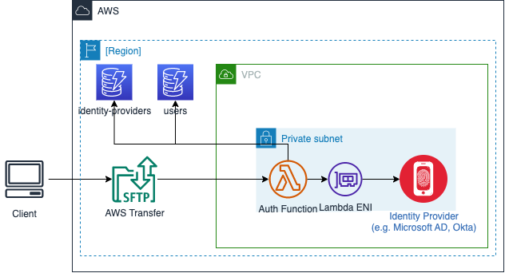
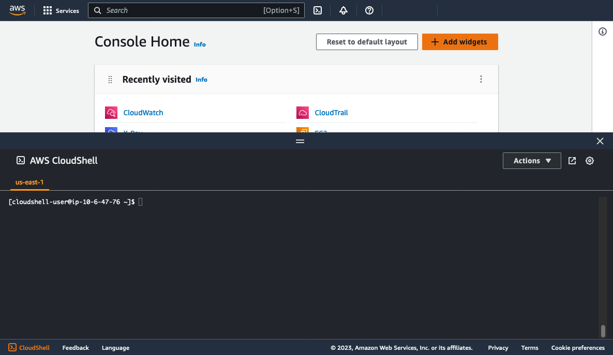
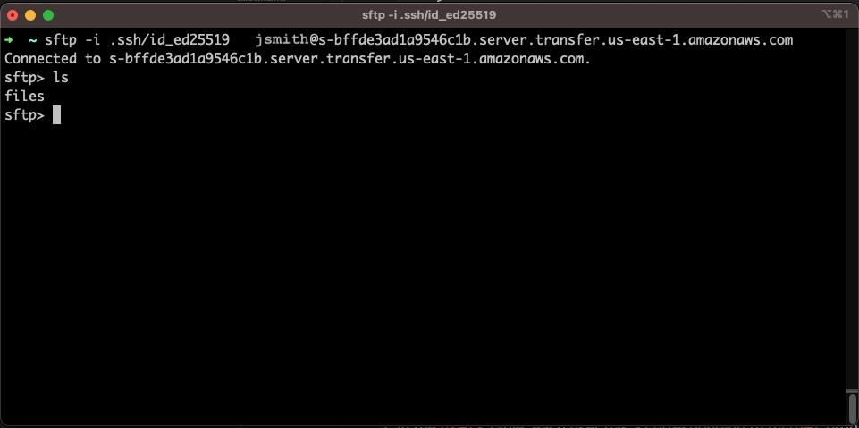

## AWS Transfer Custom IdP Solution

Content

- [AWS Transfer Custom IdP Solution](#aws-transfer-custom-idp-solution)
  - [What is this?](#what-is-this)
  - [Features](#features)
  - [Architecture](#architecture)
    - [Request flow](#request-flow)
    - [Process flow diagrams](#process-flow-diagrams)
      - [Lambda handler function](#lambda-handler-function)
      - [LDAP module](#ldap-module)
    - [DynamoDB Tables](#dynamodb-tables)
  - [Setup Instructions](#setup-instructions)
    - [Prerequisites](#prerequisites)
    - [Deploy the solution](#deploy-the-solution)
    - [Deploy an AWS Transfer server](#deploy-an-aws-transfer-server)
    - [Define identity providers](#define-identity-providers)
    - [Define Users](#define-users)
    - [(Optional) Define a `$default$` user record](#optional-define-a-default-user-record)
    - [Test the provider](#test-the-provider)
    - [Next steps](#next-steps)
  - [Identity provider modules](#identity-provider-modules)
    - [How the identity provider modules work](#how-the-identity-provider-modules-work)
    - [Identity provider module reference](#identity-provider-module-reference)
      - [LDAP and Active Directory](#ldap-and-active-directory)
        - [DynamoDB Record Schema](#dynamodb-record-schema)
        - [Parameters](#parameters)
        - [Example](#example)
      - [Okta](#okta)
        - [DynamoDB Record Schema](#dynamodb-record-schema-1)
        - [Parameters](#parameters-1)
        - [Example](#example-1)
      - [Public Key](#public-key)
        - [DynamoDB Record Schema](#dynamodb-record-schema-2)
        - [Parameters](#parameters-2)
        - [Example](#example-2)
      - [Secrets Manager](#secrets-manager)
  - [Session settings inheritance](#session-settings-inheritance)
    - [user record](#user-record)
  - [Logging and troubleshooting](#logging-and-troubleshooting)
    - [Accessing logs](#accessing-logs)
    - [Setting the log level](#setting-the-log-level)
  - [FAQ](#faq)
  - [Tutorials](#tutorials)
    - [Configuring Okta to retrieve session settings from user profile attributes](#configuring-okta-to-retrieve-session-settings-from-user-profile-attributes)
    - [Configuring Okta MFA](#configuring-okta-mfa)
  - [Contributing a Module](#contributing-a-module)


## What is this?
There are several examples of custom identity providers for AWS Transfer in AWS blog posts an documentation, but there have been no standard patterns for implementing a custom provider that accounts for details including logging and where to store the additional session metadata needed for AWS Transfer, such as the `HomeDirectoryDetails`. This solution provides a reusable foundation for implementing custom identity providers with granular per-user session configuration, and decouples the identity provider authentication logic from the reusable logic that builds a configuration that is returned to AWS Transfer to complete authentication and establish settings for the session. 

## Features
* A standard pattern and DynamoDB schema to store user's IdP and AWS Transfer session settings such as `HomeDirectoryDetails`, `Role`, and `Policy`.
* A standard pattern and DynamoDB schema to store metadata about identity providers and associated settings.
* Support for multiple identity providers connected to a single AWS Transfer Server.
* Support for multiple identity providers for the same username (by using the <IdP>\<username> or <username>@<IdP> conventions at login)
* Connect multiple AWS Transfer servers to the same instantiation of this solution (e.g. to use with both S3 and EFS servers)
* Run multiple instantiations of this solution in the same AWS account.
* Built-in IP allow-list checking.
* Standardized logging patterns with configurable log-level and tracing support.
* Easy-to-deploy infrastructure templates, with step-by-step instructions.
  * The ability to deploy an API Gateway for advanced use cases (e.g. [attaching a WAF WebACL for additional security controls](https://aws.amazon.com/blogs/storage/securing-aws-transfer-family-with-aws-web-application-firewall-and-amazon-api-gateway/))

## Architecture
This section describes the architecture of the solution and introduces the standardized process flow for an authentication request. The diagram below shows the architecture components.



### Request flow
1. Client connects to AWS Transfer service, passing credentials. The credentials are then passed to the authentication Lambda function
    
2. The Lambda function performs the following sequence to handle the authentication request:
    1. First, the handler function takes the username (and optionally parses out the identity provider name) and performs a lookup on DynamoDB table. If a matching record exists, it retrieves the record and will use this for the authentication flow. If it does not exist, a '$default$' authentication record is used.
        
    2. Using an `identity_provider_key` field, the Lambda performs a lookup on the `identity_providers` table to obtain IdP information. The `module` field in the response is used to call an idp-specific module. The lambda then passes the parsed username, `identity_provider` and `user` records to the identity provider to continue the authentication flow. 
        
    3. The identity provider module reads the provider-specific settings from the `identity_provider` record it receives. It then uses this to connect to the identity provider (when applicable) and passes the user credentials (when applicable) to authenticate. Since many identity providers are only available on private networks, the Lambda is VPC-attached and uses an ENI in a VPC for private network communication.
        
        **Note: **** **Depending on the logic in the module and the configuration in the `identity_provider` record, the module could retrieve/return additional attributes for making authorization decisions. This is a module-specific implementation detail. For example, the LDAP module supports this.
        
3. After the identity provider module completes authentication, it can make additional authorization decisions based on what is in the user record and its own custom logic. It then finalizes all AWS Transfer session settings (i.e. `Role` and `HomeDirectoryDetails` and returns them to the handler function. The handler function does final validation and returns the response to AWS Transfer.


### Process flow diagrams

#### Lambda handler function

The Lambda handler function itself contains logic for identifying the user and identity provider module to use to perform the authentication. It also checks if the source IP is allowed to initiate an authentication request (based on ipv4_allow_list attribute in each user record) before invoking the target identity provider module.


#### LDAP module

This is meant to serve as an example of what an individual module would look like. All modules would have the same entrypoint, `handle_auth` and must return a response that is valid to AWS Transfer.


### DynamoDB Tables

The solution contains two DynamoDB tables:

* **`${AWS::StackName}_users`**: Contains records for each user, including the associated identity provider to use for authentication and AWS Transfer settings that should be used if authenticated successfully.
* **`${AWS::StackName}_identity_providers`**: Contains details about each identity provider and its associated configuration settings. 

## Setup Instructions

### Prerequisites
* AWS CloudShell
  * *Note:* The instructions below are written to deploy the solution via CloudShell, but a similar environment with SAM installed will work.
* Python 3.8+ and pip
* AWS SAM (preinstalled in the CloudShell container)
* Appropriate IAM permissions to provision the solution (including but not limited to creating IAM roles, DynamoDB tables, a Lambda functions)

> [!IMPORTANT]  
> The solution must be deployed in the same AWS account and region as the target AWS Transfer servers. 

### Deploy the solution

1. Log into the AWS account you wish to deploy the solution in, switch to the region you will run AWS Transfer in, and start a CloudShell session.

    

2. Clone the solution into your environment:
    ```
    cd ~
    git clone <url will go here>
    ```
    
3. Run the following command to run the build script, which downloads all package dependencies and generates archives for the Lambda layer and function used in the solution.
    ```
    cd ~/aws-transfer-custom-idp-solution
    ./build.sh
    ```
    Monitor the execution and verify the script completes successfully.

4. Begin the SAM deployment by using the following command

    ```
    sam deploy --guided

    ```

    At the prompts, provide the following information:
    | Parameter | Description | Value |
    | --- | --- | --- |
    | **Stack name** | The name of the CloudFormation stack that will be created. The stack name is also prefixed to several resources that are created to allow the solution to be deployed multiple times in the same AWS account and region. | *your stack name, i.e. transferidp* |
    | **AWS region** | The AWS region to create the stack and resources in. **Note** | *The region to deploy in, i.e. `us-east-1`* | 
    | **Parameter Subnets** | A comma-separated list of subnet IDs to attach the Lambda function to. The Lambda is attached to subnets in order to allow private communication to IdPs such as LDAP servers or Active Directory domain controllers.  | *comma-separated list of subnet IDs, i.e. `subnet-123abc,subnet-456def`* |
    | **Parameter SecurityGroups** | A list of security group IDs to assign to the Lambda function. This is used to control inbound and outbound access to/from the ENI the Lambda function uses for network connectivity. | *comma-separated list of Security Group IDs, i.e. `sg-abc123`* |
    | **Parameter SecretsManagerPermissions** | Set to *`true`* if you will use the Secrets Manager authentication module, otherwise *`false`* | `true` or `false`|
    | **Parameter UserNameDelimiter**  | The delimiter to use when specifying both the username and IdP name during login. Supported delimiter formats: <ul><li>[username]**&#64;**[IdP-name]</li><li>[username]**$**[IdP-name]</li><li>[IdP-name]**/**[username]</li><li>[IdP-name]**&#92;&#92;**[username]</li></ul> | One of the following values: <ul><li>**&#64;**</li><li>**$**</li><li>**/**</li><li>**&#92;&#92;**</li></ul> |
    | **Parameter LogLevel** | Sets the verbosity of logging for the Lambda IdP function. This should be set to `INFO` by default and `DEBUG` when troubleshooting. <br /><br />**IMPORTANT** When set to `DEBUG`, sensitive information may be included in log entries. | `INFO` or `DEBUG` <br /> <br /> *`INFO` recommended as default* |
    | **Parameter ProvisionApi** | When set to *`true`* an API Gateway REST API will be provisioned and integrated with the custom IdP Lambda. Provisioning and using an API Gateway REST API with AWS Transfer is useful if you intend to [use AWS Web Application Firewall (WAF) WebACLs to restrict requests to authenticate to specific IP addresses](https://aws.amazon.com/blogs/storage/securing-aws-transfer-family-with-aws-web-application-firewall-and-amazon-api-gateway/) or apply rate limiting. | `true` or `false` |
    | **Parameter EnableTracing** | Set to *`true`* if you would like to enable AWS X-Ray tracing on the solution. <br /><br /> Note: X-Ray has additional costs. | `true` or `false` |
    | **Parameter UsersTableName** | The name of an *existing* DynamoDB table that contains the details of each AWS Transfer user (i.e. IdP to use, IAM role, logic directory list) are stored. Useful if you have already created a DynamoDB table and records for users **Leave this value empty if you want a table to be created for you**. | *blank* if a new table should be created, otherwise the name of an existing *users* table in DynamoDB |
    | **Parameter IdentityProvidersTableName** | The name of an *existing* DynamoDB table that contains the details of each AWS Transfer custom IdPs (i.e. IdP name, server URL, parameters) are stored. Useful if you have already created a DynamoDB table and records for IdPs **Leave this value empty if you want a table to be created for you**. | *blank* if a new table should be created, otherwise the name of an existing *IdPs* table in DynamoDB |
    | **Confirm changes before deploy** | Prompt to confirm changes after a change set is created. | `y` (default) | 
    | **Allow SAM CLI IAM role creation** | Allow SAM to create a CLI IAM role used for deployments | `y` (default) |
    | **Disable rollback** | Disable rollback if stack creation and resource provisioning fails (can be useful for troubleshooting) | `n` (default) |
    | **Save arguments to configuration file** | Save the parameters specified above to a configuration file for reuse. | `y` (default) | 
    | **SAM configuration file** | The name of the file to save arguments to | `samconfig.toml` (default) |
    | **SAM configuration environment** | The name of the configuration environment to use | `default` (default) |
    
5. When prompted, review the Changeset and then type *`y`* and press enter. Wait for the deployment to complete. 
   
6. Once the stack completes, copy/paste the **CloudFormation outputs from deployed stack** to a text editor and save them for future use. Below are descriptions of the outputs

    | Key | Description | Value |
    | --- | --- | --- |
    | `IdpHandlerFunction` | The ARN of the Lambda function. Use this ARN when configuring an AWS Transfer server to use a Lambda-based custom identity provider | `arn:${AWS::Partition}:lambda:${AWS::Region}:${AWS::AccountId}:function:${AWS::StackName}_awstransfer_idp` |
    | `IdpHandlerLogGroupUrl` | A URL that will take you to the IdpHandler function's Cloudwatch Log group. These logs can be useful for troubleshooting IdP errors. | `https://${AWS::Region}.console.aws.amazon.com/cloudwatch/home?region=${AWS::Region}#logsV2:log-groups/log-group/$252Faws$252Flambda$252F${IdpHandlerFunction}` |
    | `ApiUrl` | *Optional* A URL to the API Gateway REST API that was provisioned. Use this URL when configuring an AWS Transfer server to use an REST API-based custom identity provider. This output is only displayed when `ProvisionApi` is set to `true` | `https://${CustomIdentityProviderApi}.execute-api.${AWS::Region}.amazonaws.com/${ApiStage}` |
    | `ApiRole` | *Optional* The name of an IAM role created for AWS Transfer to use when invoking the REST API. This is used when configuring an AWS Transfer server to use an REST API-based custom identity provider. This output is only displayed when `ProvisionApi` is set to `true` | `${AWS::StackName}_TransferApiRole` |
    

### Deploy an AWS Transfer server

***Note***: If you have an existing AWS Transfer server configured to use a custom identity provider, it can be modified to use the Lambda function or API Gateway REST API instead of creating a new server by going to the AWS Transfer console, selecting the server, and clicking **Edit** next to the *Identity provider** section. If the server was not configured with a custom identity provider, or if you wish to switch between Lambda and API Gateway based providers, you will need to re-provision your AWS Transfer server.

1. Go to the AWS Transfer console in the region where the solution is deployed and click **Create server**.
   
  

1. At the **Choose protocols** screen, select the protocols to enable and click **Next**

2. At the **Choose an identity provider** screen, select **Custom Identity Provider**, then select one of the identity provider options below.

    **Option 1: Use AWS Lambda to connect your identity provider**
    
    Choose the AWS Lambda function from the list that matches the output from **`IdpHandlerFunction`** (i.e. `[StackName]_awstransfer_idp`)
    
    

    **Option 2: Use API Gateway to connect your identity provider**
    
    * Specify the API Gateway Url from the `ApiUrl` output (i.e. `https://[API].execute-api.[REGION].amazonaws.com/prod`)
    * Choose the IAM role from the list that matches the output from the **`ApiRole`** (i.e. `[StackName]_TransferApiRole`)

            

4. At the **Choose an endpoint** screen, configure the AWS transfer endpoint type and hostname, then click **Next**.
   
5. At the **Choose a domain** screen, select the AWS Storage Service to use (S3 or EFS) and click **Next**.

6. At the **Configure additional details** screen, configure any additional settings for the AWS Transfer server and click **Next**.

7. On the final screen, review and verify all settings for the new server and click **Create**.

8. At the AWS Transfer console, a new server will appear in the list and show status **Starting**. Wait for the process to complete and then proceed to configure Identity Providers.
   
    

### Define identity providers
To get started, you must define one or more identity providers in the DynamoDB table `$[StackName]_identity_providers`. Each identity provider record stores the configuration and identity provider module to use for authenticating users mapped to that provider. For complete details on identity provider modules, settings, and examples see the [Identity Provider Modules](#identity-provider-modules). To get started, this section will define an identity provider that uses the `public_key` module. 

> [!NOTE]  
> The `public_key` module is supported with AWS Transfer Servers that are configured with SFTP protocol only. If your server us using a different protocol, you should configure a different provider.

1. In the AWS Console, navigate to the DynamoDB console, select **Tables > Explore** items on the sidebar. Select the `[StackName]_identity_providers` table, then click **Create Item**.

  

2. In the **Create Item** screen, click **JSON View**, then paste the following into the record:
  ```json
  {
    "provider": {
      "S": "publickeys"
    },
    "config": {
      "M": {
      }
    },
    "module": {
      "S": "public_key"
    }
  }
  ```

1. Click the **Form** button to switch back to Form view. The attributes of the record will be displayed as shown in the screenshot below. 

   

     * The `provider` attribute contains the name defined of the identity provider. In this case, it is `publickeys` but it could be more meaningful such as `devteam-publickeys` or `example.com` if it were an external identity provider. 
     * The `module` attribute contains the name of the identity provider module to use, in this case `public_key`. 
     * The `config` is an attribute map that is used for storing identity provider configuration details. This `public_key` module is very simple and therefore has no configuration settings. Other modules such as LDAP and Okta store settings in this attribute map.

2. After reviewing, click **Create Item**. The first identity provider has now been defined. Next, we'll begin defining users.

### Define Users

Once identity providers are defined, user records must be created. Each user records may contain the settings that will be used for an AWS Transfer session and can also contain public keys when using the `public_key` module or for AWS Transfer servers configured with Public Key AND Password support. Each record also maps the username to a given identity provider. In this section, we will create a user record and map it to the `publickeys` identity provider created in the previous section.

> [!IMPORTANT]  
> All usernames specified in the `[StackName]_users` must be entered as lowercase.
>

1. As a prerequisite, a public/private key pair must be generated for use with the `public_key` module. If you do not already have a key pair, you can follow the [Generate SSH Keys procedure](https://docs.aws.amazon.com/transfer/latest/userguide/key-management.html#sshkeygen) from the AWS Transfer documentation to generate them. You do NOT need to create a service managed user and enter the public key - please skip those steps.

2. Navigate to the [DynamoDB console](https://console.aws.amazon.com/dynamodb), select **Tables > Explore** items from the sidebar. Select the `[StackName]_users` table, then click **Create Item**.

  

3. In the **Create Item** screen, click **JSON View**, then paste the following into the record:
  ```json
  {
    "user": {
      "S": "johnsmith"
    },
    "identity_provider_key": {
      "S": "publickeys"
    },
    "config": {
      "M": {
        "HomeDirectoryDetails": {
          "L": [
            {
              "M": {
                "Entry": {
                  "S": "/s3files"
                },
                "Target": {
                  "S": "/[bucketname]/prefix/to/files"
                }
              }
            },
            {
              "M": {
                "Entry": {
                  "S": "/efs"
                },
                "Target": {
                  "S": "/fs-[efs-fs-id]"
                }
              }
            }
          ]
        },
        "HomeDirectoryType": {
          "S": "LOGICAL"
        },
        "PosixProfile": {
          "M": {
            "Gid": {
              "S": "1000"
            },
            "Uid": {
              "S": "1000"
            }
          }
        },
        "PublicKeys": {
          "SS": [
            "ssh-ed25519 [PUBLICKEY]",
            "ssh-rsa [PUBLICKEY]"
          ]
        },
        "Role": {
          "S": "arn:aws:iam::[AWS Account Id]:role/[Role Name]"
        }
      }
    },
    "ipv4_allow_list": {
      "SS": [
        "0.0.0.0/0"
      ]
    }
  }
  ```


4. Click the **Form** button to switch back to Form view and expand all of the nested attributes. The rattributes of the record will be displayed as shown in the screenshot below. Below are the details of the various fields:

     * The `user` key contains the username that will be passed to AWS Transfer during authentication. This will be used to lookup the user record. **In order for lookups to success, this value must ALWAYS be lowercase.**
     * The `identity_provider_key` attribute contains the identity provider name from the `[StackName]_identity_providers` table. In this case, it is the `publickeys` provider created in the previous section. Note that this is the name of the identity provider, *not* the name of the identity provider module. 
     * The `ipv4_allow_list` attribute is a list of remote IP CIDRs that are allowed to authenticate as the user. This is an optional attribute and by default all remote IPs are allowed to authenticate as the user. 
     * The `config` attribute is a mapping of the user's session settings. Its values follow the same format as those found in the [Lambda Values Section](https://docs.aws.amazon.com/transfer/latest/userguide/custom-identity-provider-users.html#event-message-structure) of the custom identity provider documentation). This includes the `HomeDirectoryType`, `HomeDirectoryDetails` (for logical directory mappings),`PosixProfile`, and any `PublicKeys` associated with the user. Note that `PublicKeys` is an optional field, depending on the identity provider and AWS Transfer authentication method.
       * Note that `HomeDirectoryDetails` can have both S3 and EFS targets, in the scenario you wish to use the solution with both an S3 and EFS AWS Transfer server.

    

5. Modify the user configuration details to reflect your environment. Specifically, you should set:
  * `HomeDirectoryDetails`: Modify this list, setting the `Target` values to S3 buckets or EFS filesystems.
  * `PosixProfile`: If connecting to an AWS Transfer server attached to EFS, change the `Uid` and `Gid` to reflect those belonging to the user. Note that this is not required for Transfer servers attached to S3.
  * `PublicKeys`: Since this user will be authenticated with the `public_key` module, provide one or more valid public keys that will be used to authenticate the user (e.g. the contents of the `.pub` key generate in step 1 of this section). Each public key should be its own entry in the `PublicKeys`.
  * `Role`: Specify the AWS Transfer IAM Role that will be used to access data in S3 and EFS. Remember: This role must have a trust policy that gives the AWS Transfer service permission to assume it and must have the correct policies attached for accessing the data in S3 or EFS. For more information, refer to the [AWS Transfer documentation](https://docs.aws.amazon.com/transfer/latest/userguide/requirements-roles.html).


6. After reviewing, click **Create Item**. The first user, `joesmith`, has been created and mapped to the `publickeys`. Next we can (optionally) create a *default* user and finally test authentication.

### (Optional) Define a `$default$` user record
While this solution is designed to provide very granular and flexible authentication and authorization to AWS Transfer users to support a variety of use cases, there are use cases where all users will access the same identity provider and either apply the same AWS Transfer session configuration such as `Role`, `PosixProfile`, and `Policy`, or retrieve session configuration parameters dynamically from the source identity provider itself. The `$default$` user record is designed to support these scenarios. The `$default$` user record is used when the Lambda function is unable to find a user record that matches the username received in the request. 

Here are some important considerations for this record:
* If no `$default$` record is specified, authentication will simply fail (which may be intended).  
* Unless the identity provider overrides them, all users that authenticate with the `$default$` user will receive the session settings (i.e. `Role`, `PosixProfile`, and `Policy`) defined in the record. If more granularity is desired, you should define individual user records for each record.
* Be careful when specifying a `$default$` record when there are other user records specified. Keep in mind that any username that doesn't match will attempt to use `$default` which could produce unexpected session access.

Below is an example of a `$default$` user record, for mapped to an an Active Directory or LDAP identity provider. 

```json
{
  "user": {
    "S": "$default$"
  },
  "identity_provider_key": {
    "S": "example.com"
  },
  "config": {
    "M": {
      "HomeDirectoryDetails": {
        "L": [
          {
            "M": {
              "Entry": {
                "S": "/pics"
              },
              "Target": {
                "S": "/[bucket name]/pictures"
              }
            }
          },
          {
            "M": {
              "Entry": {
                "S": "/files"
              },
              "Target": {
                "S": "/[bucket name]/files"
              }
            }
          }
        ]
      },
      "HomeDirectoryType": {
        "S": "LOGICAL"
      },
      "Role": {
        "S": "arn:aws:iam::[aws account id]:role/[role name]"
      }
    }
  },
  "ipv4_allow_list": {
    "SS": [
      "0.0.0.0/0"
    ]
  }
}
```
To further illustrate a scenario where `$default$` is used, suppose `PosixProfile` and a scoped `Policy` are retrieved from Active Directory or LDAP server. This is what the identity provider record might look like.

```
{
  "provider": {
    "S": "example.com"
  },
  "config": {
    "M": {
      "attributes": {
        "M": {
          "Gid": {
            "S": "gidNumber"
          },
          "Policy": {
            "S": "comment"
          },
          "Uid": {
            "S": "uidNumber"
          }
        }
      },
      "port": {
        "N": "636"
      },
      "search_base": {
        "S": "DC=EXAMPLE,DC=COM"
      },
      "server": {
        "S": "dc1.example.com"
      },
      "ssl": {
        "BOOL": true
      },
      "ssl_verify": {
        "BOOL": false
      }
    }
  },
  "module": {
    "S": "ldap"
  }
}
```
The record above dynamically maps Active Directory/LDAP attributes `uidNumber`, `gidNumber`, and `comments` to `Uid`, `Gid`, and scopedown `Policy` in the AWS Transfer session configuration.


### Test the provider
To test the identity provider `publickeys` and user `joesmith` created in the previous sections, use an SFTP client to connect to the AWS Transfer server. For example, on a Linux or Mac client with `sftp` client installed open a terminal window and enter the command to connect:
```bash
  sftp -i path/to/privatekey johnsmith@[transfer-server-endpoint-address]
```

Below is an example of a successful connection and file/directory listing:



To view the provider logs, open Cloudwatch Logs and select the log group `/aws/lambda/[StackName]_awstransfer_idp`. The log streams will show the login event and details about the user and identity provider evaluation. If there was a failure, you will also see error messages and exceptions in this log. Below is a screenshot showing the logging in near realtime using [Cloudwatch Live Tail](https://docs.aws.amazon.com/AmazonCloudWatch/latest/logs/CloudWatchLogs_LiveTail.html). 


> [!NOTE]  
> If the Lambda logs don't show failures but SSH key authentication still fails and/or prompts for a password, it's possible that AWS Transfer did not successfully verify the supplied private key against the public key. It's also possible that required session properties were missing or misconfigured in the user record. Check the [AWS Transfer server log group](https://docs.aws.amazon.com/transfer/latest/userguide/structured-logging.html) for additional details.

### Next steps
With the solution setup completed and tested, you can begin adding more identity provider and user records, and explore advanced functionality in each module to support your use case. The [identity provider modules](#identity-provider-modules) section provides detailed information about each identity provider, its configuration settings, and example configurations. 

## Identity provider modules
This section describes how the identity provider modules work and describes the module-specific parameters that are used in each module's configuration. 

### How the identity provider modules work
In the `users` table, each user has a corresponding `provider` property that indicates the provider from in the `identity_providers` table that should be used for authentication. 
1. When a user initiates authentication, the user record is retrieved and the `provider` value is used to lookup corresponding record in the `identity_providers` table. 
2. The `module` value is used to load the corresponding identity provider module (stored in the `idp_handler/idp_modules` directory of the source code)
3. The `handle_auth` function is called, passing the configurations stored in both the user and identity provider records to the module for it to use.

Any module-specific settings are stored in the `config` value of the record within the `identity_providers` table. This is a DynamoDB `Map` value that can contain multiple nested values. 


### Identity provider module reference
#### LDAP and Active Directory
The `ldap` module supports authentication with Active Directory and LDAP servers. Both LDAP and LDAPS are supported. User attributes can be retrieved and mapped to the server response, such as `Uid` and `Gid`. 

##### DynamoDB Record Schema
```json
{
  "provider": {
    "S": "[provider name]"
  },
  "config": {
    "M": {
      "attributes": {
        "M": {
          "Gid": {
            "S": "[LDAP attribute name]"
          },
          "Uid": {
            "S": "[LDAP attribute name]"
          },          
          "Role": {
            "S": "[LDAP attribute name]"
          },
          "Policy": {
            "S": "[LDAP attribute name]"
          }
        }
      },
      "ignore_missing_attributes": {
        "BOOL": [true or false]
      },
      "port": {
        "N": "[port number]"
      },
      "search_base": {
        "S": "LDAP search base"
      },
      "server": {
        "S": "[LDAP server address]"
      },
      "ssl": {
        "BOOL": [true or false]
      },
      "ssl_verify": {
        "BOOL": [true or false]
      }
    }
  },
  "module": {
    "S": "ldap"
  }
}
```
##### Parameters

**provider**

A name used for referencing the provider in the `users` table. This value is also used when users specify an identity provider during authentication (e.g. `username@provider`).

**Type:** String

**Constraints:** None

**Required:** Yes

**module**

The name of the LDAP module that will be loaded to perform authentication. **This should be set to `ldap`.**

Type: String

Constraints: None

Required: Yes

**config/server**

The DNS address or IP address of the LDAP server or domain to connect to for authentication.

Type: String

Constraints: Must be a FQDN or IP address

Required: Yes

**config/search_base**

The LDAP search base to when connecting to LDAP and to lookup any users/attributes in. For example, in AD domain `EXAMPLE.COM` it may be `DC=EXAMPLE,DC=COM`. 

Type: String

Constraints: Must be a valid LDAP search base.

Required: Yes

**config/port**

The port number of the LDAP or Active Directory server to connect to. This is typically `389` for non-SSL and `636` for SSL.

Type: Number

Constraints: Must be a valid port number

Required: No

Default: `636`

**config/ssl**

Determines if an SSL connection should be established to the server. SSL is enabled by default.

Type: Boolean

Constraints: Must be `true` or `false`

Required: No

Default: `true`

**config/ssl_verify**

When set to `true` and connecting with SSL, the identity of the server will be validated against the address used in the `config/server` value and that the certificate is valid. Set to `false` if the server name does not match the DNS address used or has a self-signed certificate (i.e. for testing). 

Type: Boolean

Constraints: Must be `true` or `false`

Required: No

Default: `true`

**config/attributes**

An optional key/value map of AWS Transfer user attributes and the corresponding LDAP or AD attributes that should be retrieved and used for them. 

For example, if you wish to pass a `Uid` and `Gid` from AD or LDAP to AWS Transfer to use in `PosixProfile` and the values are stored in `UidNumber` and `GidNumber` attributes in LDAP or AD, the entry would be:
```json
"attributes": {
  "M": {
      "Gid": {
      "S": "gidNumber"
      },
      "Uid": {
      "S": "uidNumber"
      }
  }
}
```
> [!NOTE]  
> Any attributes returned will override corresponding values that have been specified in the user's record from the `users` table. 

Type: Map

Constraints: Only attribute keys `Gid`, `Uid`, `Policy`, and `Role` are supported.

Required: No

Default: *none*

**config/ignore_missing_attributes**

When set to `true`, any LDAP or AD attributes that return no value in the `attributes` map will be ignored. Otherwise, the authentication is considered a failure.

When enabled the value is missing, any corresponding values that have been specified in the user's record from the `users` table will be used. 

> [!NOTE]  
> It is recommended this be set to `false`, since missing or empty attributes could indicate the user's LDAP or AD profile has not been correctly configured and an empty attribute such as `Policy` could provide less restrictive access than desired. 

Type: Boolean

Constraints: Must be `true` or `false`

Required: No

Default: `false`

##### Example
```json
{
  "provider": {
    "S": "example.com"
  },
  "config": {
    "M": {
      "attributes": {
        "M": {
          "Gid": {
            "S": "gidNumber"
          },
          "Role": {
            "S": "comment"
          },
          "Uid": {
            "S": "uidNumber"
          }
        }
      },
      "ignore_missing_attributes": {
        "BOOL": false
      },
      "port": {
        "N": "636"
      },
      "search_base": {
        "S": "DC=example,DC=com"
      },
      "server": {
        "S": "ldap.example.com"
      },
      "ssl": {
        "BOOL": true
      },
      "ssl_verify": {
        "BOOL": true
      }
     },
     "Role": {
        "S": "arn:aws:iam::123456789012:role/examplecom-AWSTransferRole"
    }
  }
  },
  "module": {
    "S": "ldap"
  }
}
```
#### Okta

The `okta` module supports authentication with an Okta instance. It supports TOTP-based MFA and can optionally retrieve user profile attributes and map them to session settings such as `Uid` and `Gid`. 

##### DynamoDB Record Schema
```json
{
  "provider": {
    "S": "[provider name]"
  },
  "config": {
    "M": {
      "attributes": {
        "M": {
          "Gid": {
            "S": "[Okta profile attribute name]"
          },
          "Uid": {
            "S": "[Okta attribute name]"
          },          
          "Role": {
            "S": "[Okta attribute name]"
          },
          "Policy": {
            "S": "[Okta attribute name]"
          }
        }
      },
      "ignore_missing_attributes": {
        "BOOL": [true or false]
      },
      "mfa_token_length": {
        "N": "[token length]"
      },
      "okta_domain": {
        "S": "[FQDN Okta domain]"
      },
      "okta_app_client_id": {
        "S": "[app client id]"
      },
      "okta_redirect_uri": {
        "S": "[app client id]"
      },      
      "mfa": {
        "BOOL": [true or false]
      }
    }
  },
  "module": {
    "S": "okta"
  }
}
```
##### Parameters

**provider**

A name used for referencing the provider in the `users` table. This value is also used when users specify an identity provider during authentication (e.g. `username@provider`).

**Type:** String

**Constraints:** None

**Required:** Yes

**module**

The name of the Okta module that will be loaded to perform authentication. **This should be set to `okta`.**

Type: String

Constraints: None

Required: Yes

**config/okta_domain**

The DNS address or IP address of the Okta domain to connect to for authentication.

Type: String

Constraints: Must be a FQDN or IP address

Required: Yes

**config/okta_app_client_id**

The Client ID of the Okta application that will be used to obtain a session cookie and retrieve user profile attributes. **Only required if Okta user profile attributes will be retrieved from Okta. The Okta application must be configured with Okta API scope `okta.users.read.self`. 

Type: String

Constraints: Must be a valid Client ID associated with a native Okta application. 

Required: No.

**config/okta_redirect_uri**

A "Sign-in redirect URI" that will be passed in the request to retrieve a session cookie for the Okta application. Each Okta application defines a valid list of redirect URIs that clients are allowed to be redirected to after authentication. The URI does not have to be a valid website, but the URI passed in the request must match the list of URIs allowed by the application in order for a session cookie to be returned.

Type: Boolean

Constraints: Must be a valid "Sign-in redirect URI" that is allowed in login requests for the Okta application. 

Required: No

Default: `awstransfer:/callback`

**config/mfa**

When set to `true`, indicates Okta is configured to required MFA. When enabled, users must enter their password plus the temporary one time code when prompted for their password (e.g. `password123456`)

Only TOTP MFA is supported by this module.

Type: Boolean

Constraints: Must be `true` or `false`

Required: No

Default: `false`

**config/mfa_token_length**

The number of digits to expect in the MFA token that is appended to the password. By default, a 6-digit code is assumed.

Type: Integer

Constraints: Must be an integer greater than zero

Required: No

Default: `6`

**config/attributes**

An optional key/value map of AWS Transfer user attributes and the corresponding Okta user profile attributes that should be retrieved and used for them. When this value is set, `okta_app_client_id` must be set to retrieve user profile attributes from Okta.

For example, if you wish to pass a `Uid` and `Gid` from Okta to AWS Transfer to use in `PosixProfile` and the values are stored in `UidNumber` and `GidNumber` attributes in the Okta user's profile, the entry would be:
```json
"attributes": {
  "M": {
      "Gid": {
      "S": "gidNumber"
      },
      "Uid": {
      "S": "uidNumber"
      }
  }
}
```
> [!NOTE]  
> Any attributes returned will override corresponding values that have been specified in the user's record from the `users` table. 

Type: Map

Constraints: Only attribute keys `Gid`, `Uid`, `Policy`, and `Role` are supported.

Required: No

Default: *none*

**config/ignore_missing_attributes**

When set to `true`, any Okta user profile attributes that return no value in the `attributes` map will be ignored. Otherwise, the authentication is considered a failure.

When enabled the value is missing, any corresponding values that have been specified in the user's record from the `users` table will be used. 

> [!NOTE]  
> It is recommended this be set to `false`, since missing or empty attributes could indicate the user's Okta profile has not been correctly configured and an empty attribute such as `Policy` could provide less restrictive access than desired. 

Type: Boolean

Constraints: Must be `true` or `false`

Required: No

Default: `false`

##### Example

The following example identity provider record configures the Okta module to:
* Connect to the okta domain `dev-xxxxx.okta.com`
* Enable MFA with a 6-digit token
* Retrieve Gid, Uid, Role, and Policy attributes from Okta user profile attributes


```json
{
  "provider": {
    "S": "okta.example.com"
  },
  "config": {
    "M": {
      "attributes": {
        "M": {
          "Gid": {
            "S": "gidNumber"
          },
          "Uid": {
            "S": "uidNumber"
          },          
          "Role": {
            "S": "AWSTransferRole"
          },
          "Policy": {
            "S": "AWSTransferScopeDownPolicy"
          }
        }
      },
      "ignore_missing_attributes": {
        "BOOL": false
      },
      "mfa_token_length": {
        "N": "6"
      },
      "okta_domain": {
        "S": "dev-xxxxx.okta.com"
      },
      "okta_app_client_id": {
        "S": "0123abcDE456f78gH9"
      },
      "okta_redirect_uri": {
        "S": "callback:/awstransfer"
      },      
      "mfa": {
        "BOOL": true
      }
    }
  },
  "module": {
    "S": "okta"
  }
}
```

#### Public Key
The Public Key module is is used to perform authentication with public/private key pairs. The module itself *does not* perform this validation - it simply verifies that `PublicKeys` for the user are included in the response to AWS Transfer so that it can complete validation of the private key. There are no settings to configure.

##### DynamoDB Record Schema
```json
{
  "provider": {
    "S": "[provider name]"
  },
  "config": {
  },
  "module": {
    "S": "public_key"
  }
}
```
##### Parameters

**provider**

A name used for referencing the provider in the `users` table. This value is also used when users specify an identity provider during authentication (e.g. `username@provider`).

**Type:** String

**Constraints:** None

**Required:** Yes

**module**

The name of the public key module that will be loaded to perform authentication. **This should be set to `public_key`.**

Type: String

Constraints: None

Required: Yes

##### Example

The following example configures the public key provider with a provider name `publickeys`. 

```json
{
  "provider": {
    "S": "publickeys"
  },
  "config": {
    "M": {
    }
  },
  "module": {
    "S": "public_key"
  }
}
```
#### Secrets Manager

TODO 

## Session settings inheritance
When an AWS Transfer Family custom identity provider authenticates a user, it returns all session setup properties such as the `HomeDirectoryDetails`, `Role`, and `PosixProfile` . To maximize the flexibility of this solution, most of those values can can be specified in the user record, identity provider record, as well as from the identity provider itself (i.e. LDAP attributes). When a value is contained is multiple sources, there is an ordered inheritance/priority to merge the final values together, with 1 being the highest priority:

1. Values returned by the identity provider. 

    **Note:** Each identity provider module is responsible for the logic to apply/override values.
2. Values in `config` field of the user record `users` table
3. values in the `config` of the identity provider record in the `identity_providers` table

**Example Scenario:** An organization wishes to setup an LDAP identity provider. They want the AWS Transfer server to use `UidNumber` and `GidNumber` attributes from the LDAP server, have all users for that identity provider share the same `Role`, and specify all other settings on a per-user basis. This is what the corresponding `user` and `identity_provider` records might look like:

**identity_provider record**
```json
{
    "provider": {
        "S": "example.com"
    },
    "config": {
        "M": {
            "attributes": {
                "M": {
                    "Gid": {
                        "S": "gidNumber"
                    },
                    "Role": {
                        "S": "comment"
                    },
                    "Uid": {
                        "S": "uidNumber"
                    }
                }
            },
            "ignore_missing_attributes": {
                "BOOL": false
            },
            "port": {
                "N": "636"
            },
            "search_base": {
                "S": "DC=example,DC=com"
            },
            "server": {
                "S": "ldap.example.com"
            },
            "ssl": {
                "BOOL": true
            },
            "ssl_verify": {
                "BOOL": true
            },
            "Role": {
                "S": "arn:aws:iam::123456789012:role/examplecom-AWSTransferRole"
            }
        }
    },
    "module": {
        "S": "ldap"
    }
}
```

### user record

```json
{
    "user": {
        "S": "johnsmith"
    },
    "identity_provider_key": {
        "S": "example.com"
    },
    "config": {
        "M": {
            "HomeDirectoryDetails": {
                "L": [{
                        "M": {
                            "Entry": {
                                "S": "/home"
                            },
                            "Target": {
                                "S": "organization-bucket/users/johnsmith"
                            }
                        }
                    },
                    {
                        "M": {
                            "Entry": {
                                "S": "/finance"
                            },
                            "Target": {
                                "S": "organization-bucket/departments/finance"
                            }
                        }
                    }
                ]
            },
            "HomeDirectoryType": {
                "S": "LOGICAL"
            }
        }
    },
    "ipv4_allow_list": {
        "SS": [
            "172.31.0.0/16",
            "192.168.10.0/24"
        ]
    }
}
```

## Logging and troubleshooting
The solution includes detailed logging to help with troubleshooting. Below are details on how to configure log levels and use logs for troubleshooting.

### Accessing logs
The Lambda function writes all Logs to Cloudwatch Logs, which can be accessed from the [Cloudwatch console](https://console.aws.amazon.com/cloudwatch/home) in the region the solution is deployed in. The name of the log group is `/aws/lambda/${AWS::StackName}_awstransfer_idp`

> [!NOTE]
> For live troubleshooting, consider using [Cloudwatch Live Tail](https://docs.aws.amazon.com/AmazonCloudWatch/latest/logs/CloudWatchLogs_LiveTail.html) to view requests in near real-time.

> [!NOTE]  
> If the Lambda logs do not show any failures but authentication still fails and/or prompts for a password, it's possible that AWS Transfer did not successfully verify private key against the public key. It's also possible that required session properties were missing or misconfigured in the user record. Check the [AWS Transfer server log group](https://docs.aws.amazon.com/transfer/latest/userguide/structured-logging.html) for additional details.
>
### Setting the log level
The solution supports two logging levels: `INFO` and `DEBUG`. By default, logging is set to the `INFO` level. While `INFO` logging provides many details about an authentication request, there may be times where it's necessary to retrieve raw request information and values for troubleshooting. To change the log level to `DEBUG` you can do the following:

1. In the CloudFormation console, go to **Stacks** and select the solution stack that was deployed. 
2. Click the **Update** button at the top of the stack list.
3. On the **Prepare template** screen, select **Use existing template** and click **Next**.
4. On the **Specify stack details** screen, change the **LogLevel** setting to `DEGBUG` and click **Next**
5. On the **Configure stack options** screen leave all settings as is and click **Next** at the bottom.
6. On the **Review** screen, review all settings, click any of the requires **Capabilities** checkboxes at the bottom, then click **Submit**.
7. Verify the update completes successfully. 

Follow these same steps to return the **LogLevel** setting to `INFO` after finishing troubleshooting.

> [!WARNING]
> Setting the log level to `DEBUG` can result in sensitive information being included in logs, since other Python packages used in the solution will log raw request information. Be mindful of this when sharing these logs and granting access to them. **Consider using `DEBUG` only in non-production environments with non-sensitive test accounts.**

## FAQ

## Tutorials

### Configuring Okta to retrieve session settings from user profile attributes

### Configuring Okta MFA

## Contributing a Module
Want to contribute a module? Please see the [CONTRIBUTING] document for more guidance and standards for building a module and contributing it to this solution. [TODO]


## Security

See [CONTRIBUTING](CONTRIBUTING.md#security-issue-notifications) for more information.

## License

This library is licensed under the MIT-0 License. See the LICENSE file.

